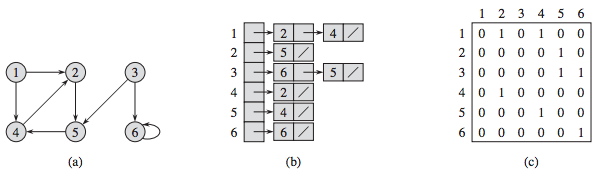

# General enterprise questions

## Software engineering

### Architectures

#### What is `n-tier (or multi-tier)` architecture?

N-tier architecture is a layered architecture where components are separated based on their responsibilities. Each layer
communicates with its adjacent layer and has its own set of responsibilities. Typical layers include Presentation,
Business Logic, and Data Access layers.

`Layers:`

- View Layer (UI Layer)
- Service Layer
- Business Logic Layer
- Data Access Layer (Persistence Layer)

<div style="text-align:center;">

</div>

#### What are `microservices`? Advantages and disadvantages?

Microservices is an architectural style that structures an application as a collection of loosely coupled services.
Each service is independently deployable and scalable.

- `Advantages`:
    - `Scalability`: Easy to scale individual components.
    - `Maintainability`: Because of smaller codebase and scope.
    - `Flexibility`: Use of different technologies and languages.

- `Disadvantages`:
    - `Complexity`: More moving parts mean more complexity.
    - `Data Integrity`: Requires careful management of data between services.
    - `Network Overhead`: Due to inter service communication.

<div style="text-align:center;">

</div>

#### What is `Separation of Concerns`?

`Separation of Concerns is a design principle` where each module or class in a system should have responsibility over a
single part of the functionality. This results in a system that is easier to manage, test, and extend.

`Separation of concerns is a principle` used in programming to separate an application into units, with minimal
overlapping between the functions of the individual units. The separation of concerns is achieved using modularization,
encapsulation and arrangement in software layers.


#### What is a `layered design` and why is it important in enterprise applications?

Layered design refers to organizing code in a way that separates concerns, usually
into `presentation`, `business logic`, and `data access layers`. It is crucial in enterprise applications to manage
complexity, facilitate maintenance, and allow for scalability.

#### What is `Dependency Injection`?

`Dependency Injection is a design pattern` where an object’s dependencies are injected by an external entity, promoting
loose coupling and enhancing testability and maintainability.

There are several different styles of dependency injection:

- `Interface injection`: An injector method, provided by a dependency, injects the dependency into another client.
  Clients
  then need to implement an interface that uses a setter method to accept the dependency.
- `Constructor injection`: An injector provides a dependency using a client class constructor. It is used when a class
  object is created.
- `Setter injection`. An injector provides a dependency using the setter method, which sets and modifies the value of a
  class's private instance variable.
- `Method injection`: A client class is used to implement an interface. A method then provides the dependency, and an
  injector uses the interface to supply the dependency to the class.

#### What is the `DAO pattern`? When and how to implement?

`DAO (Data Access Object) pattern` abstracts and encapsulates all access to the data source. Use DAO to `separate
low-level data accessing operations from high-level business services`. Implement when you want to `decouple business
logic from data access logic`.

#### What is `SOA`? When to use?

`SOA (Service-Oriented Architecture)` is a style where services are provided to the other components via protocol
requests. Use SOA when building scalable, maintainable, and reusable systems, particularly when integrating diverse
systems.


### Testing

#### What are `unit test, integration test, system test, regression test, acceptance test`? What is the major difference between these?

- `Unit Test`: Tests individual units/components of a system.
- `Integration Test`: Tests the combination of individual units.
- `System Test`: Tests the complete system as a whole.
- `Regression Test`: Ensures that new changes haven't broken existing functionality.
- `Acceptance Test`: Validates that the system meets the specified requirements.

The major difference is the `scope and the level` at which they operate within the application’s architecture.

#### What is `code coverage`? Why is it used? How you can measure?

Code coverage is a metric that indicates the percentage of code executed during testing. It is used to ensure that the
tests adequately cover the codebase. Measurement tools include coverage.py for Python and JaCoCo for Java.

#### What does `mocking` mean? How would you do it 'manually' (i.e. without using any fancy framework)?

Mocking involves creating objects that simulate the behavior of real objects. Manually, you could create a class with
the same interface as the real object but only implement the methods needed for the test, returning fixed values.

#### What is a `test case`? What is an `assertion`? Give examples!

A test case is a set of conditions or variables used to determine if a system under test works correctly. An assertion
is a statement that checks if a condition is true.

python
Copy code
def test_addition():
assert add(2, 3) == 5 # `assert` is the assertion here

```java
import org.junit.jupiter.api.Test;

import static org.junit.jupiter.api.Assertions.*;

public class MathUtilsTest {

    @Test
    public void testAddition() {
        MathUtils mathUtils = new MathUtils();
        int result = mathUtils.add(5, 3);
        // Assertion to check if the result is equal to the expected value
        assertEquals(8, result, "The addition result is incorrect");
    }

    @Test
    public void testDivision() {
        MathUtils mathUtils = new MathUtils();
        double result = mathUtils.divide(10, 2);
        // Assertion to check if the result is within a delta of 0.0001 to the expected value
        assertEquals(5.0, result, 0.0001, "The division result is incorrect");
    }

    @Test
    public void testArrayEquality() {
        int[] array1 = {1, 2, 3};
        int[] array2 = {1, 2, 3};
        // Assertion to check if two arrays are equal
        assertArrayEquals(array1, array2, "Arrays are not equal");
    }
}
```

#### What is `TDD`? What are the benefits?

`Test-Driven Development (TDD)` is a methodology where tests are written before the code. Benefits include cleaner code,
easier maintenance, and reduction in the number of bugs.

#### What are the `unit testing best practices`? (e.g. how many assertion should a test case contain?)

- Write tests for all critical paths.
- Keep them fast.
- One logical assert per test.
- Test only one code unit at a time.
- Name tests clearly and consistently.

#### What is `arrange / act / assert` pattern?

`Arrange / Act / Assert` is a pattern used in writing tests:

- `Arrange`: Set up the objects and data.
- `Act`: Perform the action to test.
- `Assert`: Verify the action’s result.

### DevOps

#### What is `continuous integration`? Why is `CI` important?

`Continuous Integration (CI)` is the practice of merging all developer working copies to a shared mainline several times
a day. CI is crucial to detect errors quickly and ensure that the mainline is always in a state ready for deployment.

<div style="text-align:center;">

</div>

#### Why are `tests` important `in the CI workflow`?

Tests are essential in CI `to catch bugs early`, ensure software quality, and prevent regressions, enabling faster, more
reliable software development cycles.

#### Name some `software that help the CI workflow`!

Jenkins, Travis CI, CircleCI, GitLab CI/CD, and `GitHub Actions` are examples of tools that facilitate CI workflows.

#### What is `Continuous Delivery`?

`Continuous Delivery (CD)` is the practice of `keeping codebase in a deployable state` and releasing changes to users
safely and quickly through automated deployments.

#### What is `Continuous Deployment`?

`Continuous Deployment` is an extension of Continuous Delivery where every change that passes all stages of the
production pipeline is `released to the users automatically`, with no human intervention.

#### What is `DevOps`?

DevOps is a set of practices that combines software development and IT operations aiming to shorten the systems
development life cycle and provide continuous delivery with high software quality.

### Software Methodologies

#### What kind of `software-lifecycle models` do you know?

Waterfall, V-Model, Incremental, Spiral, Agile, and DevOps are different software lifecycle models, each with its unique
approach to software development.

<div style="text-align:center;">

</div>

#### What is a `UML diagram`? What kind of diagram types do you know?

`UML (Unified Modeling Language)` is a standardized modeling language used to `visualize the design of a system`. Types
include Class Diagrams, Sequence Diagrams, Use Case Diagrams, and Activity Diagrams.

#### What is a `UML Class Diagram`? What are the typical elements?

A UML class diagram represents the static structure of a system, showing the system's classes, attributes, operations,
and relationships. Typical elements include Classes, Interfaces, and Associations.

<div style="text-align:center;">

</div>

#### What kind of `design patterns` do you know? Bring at least 3 examples.

- `Singleton Pattern`: Ensures a class has only one instance.
- `Adapter Pattern`: Allows objects with incompatible interfaces to collaborate.
- `Factory Method Pattern`: Defines an interface for creating an object.

#### What is the purpose of the `Iterator Pattern`?

Iterator Pattern provides a way to access the elements of an aggregate object sequentially without exposing its
underlying representation, promoting a cleaner API and encapsulation of the internal structure.

<div style="text-align:center;">

</div>

#### What do you know about the `SOLID principles`?

`SOLID principles` are a set of design principles in object-oriented design and programming:

- `Single Responsibility Principle`: A class should have one, and only one, reason to change.
- `Open/Closed Principle`: Software entities should be open for extension but closed for modification.
- `Liskov Substitution Principle`: Subtypes must be substitutable for their base types.
- `Interface Segregation Principle`: Classes should not be forced to implement interfaces they do not use.
- `Dependency Inversion Principle`: High-level modules should not depend on low-level modules.

#### How would you `separate data storage code and business logic code` (which uses stored data) in an application?

Separate data storage and business logic by `using the Repository pattern` to handle data access and
the `Service pattern`to handle business logic. This promotes `Separation of Concerns` and makes the application easier
to maintain and test.

<div style="text-align:center;">

</div>

## Computer science

### Data Structures

#### What is the `difference between Stack and Queue` data structure?

Both are linear data structures.

- `Stack`: A `LIFO (Last In First Out)` structure. The element inserted at the last, is the first element to come out of
  the list. In `Stack` `elements can be inserted and deleted only from one side` of the list, called the `top`.

<div>

</div>

- `Queue`: A `FIFO (First In First Out)` structure. The element inserted at the first, is the first element to come out
  of the list. In `Queue` elements `can be inserted only from one side of the list called rear`, and the `elements can
  be deleted only from the other side called the front`.

<div>

</div>

#### What is a `GRAPH`? What are simple graphs? What are directed graphs? What are weighted graphs?

<div>

</div>

- `Graph`: `A collection of NODES and EDGES`.\
  
- `Simple Graphs`: Graphs with no loops and no more than one edge between any two vertices.\
  
- `Directed Graphs` (DiGraphs): Graphs where edges have a direction.\
  
- `Weighted Graphs`: Graphs where each edge has a weight or cost associated with it.\
  

#### What are `trees`? What are binary trees? What are binary search trees?

- `Trees`: A hierarchical data structure with a root element and a collection of child elements.

<div>

</div>

- `Binary Trees`: A tree where each node has at most two children: left and right.

<div>

</div>

- `Binary Search Trees (BST)`:
    - The left subtree of a node contains only nodes with keys lesser than the node’s key.
    - The right subtree of a node contains only nodes with keys greater than the node’s key.
    - The left and right subtree each must also be a binary search tree.


#### How can you `store graphs in programs`? What are the advantages / disadvantages per each?

Graphs can be stored using `Adjacency List (b)` or `Adjacency Matrix (c)`. (szomszédsági in hun.)\


- `Adjacency List (b)`:
    - Advantages: Space-efficient for sparse graphs.
    - Disadvantages: Slower lookups compared to the matrix for specific edges.

- `Adjacency Matrix (c)`:
    - Advantages: Quick lookups to check the presence of a specific edge.
    - Disadvantages: Space-inefficient for sparse graphs.

#### What are `graph traversal algorithms`? What is `BFS`, how does it work? What is `DFS`, how does it work?

Graph traversal algorithms are techniques used to explore all vertices of a graph.

- `BFS (Breadth-First Search)`: Explores all neighbor `horizontally`, vertices at the current depth before moving on to
  vertices at the
  next depth level. Uses a `queue` to achieve this.

<div>

</div>

- `DFS (Depth-First Search)`: Explores as far as possible along each branch `vertically` before backtracking. Uses a
  `stack` or `recursion to achieve this.

<div>

</div>

#### How does `dictionary work`?

A dictionary is a `collection of key-value pairs` where each key is unique. It usually `uses a hash table` to provide
quick access to the value associated with a given key.

#### Why is it important for `keys in a hashmap to have an immutable type`? (Consider string for example.)

Immutable types are crucial for hashmap keys `to prevent modification of the keys` after they are placed in the hashmap,
which would otherwise result in incorrect mappings and possible data loss.

### Algorithms

#### What is `QuickSort`? Describe the main logic of this sorting algorithm.

`QuickSort` is a `divide-and-conquer algorithm` that works by selecting a 'pivot' element from the array and
partitioning the other elements into two sub-arrays, according to whether they are less than or greater than the pivot.
This process is recursively applied to sub-arrays until the array is sorted.

<div>

</div>

## Software design

### Security

#### What is `OAuth2`?

`OAuth2 is an authorization framework` that allows applications to obtain limited access to user accounts on an HTTP
service. It provides a way for users to grant third-party applications access to their resources without sharing their
credentials.

<div style="text-align:center;">

</div>
<div style="text-align:center;">

</div>

#### What is `Basic Authentication`?

Basic Authentication is a simple authentication scheme built into the HTTP protocol. It involves the client sending the
`username and password as Base64-encoded text in the HTTP header`.


#### What is `CORS`, why it’s needed in browsers?

`Cross-Origin Resource Sharing (CORS)` is a security feature implemented by web browsers to restrict web pages from
making requests to a domain different from the one that served the web page. It’s needed to prevent malicious websites
from making unauthorized API requests on behalf of the user.


#### How can you initialize a `CSRF` attack?

A `CSRF (Cross-Site Request Forgery)` attack can be initiated by tricking the victim’s browser to send an HTTP request
to a target site where the victim is authenticated, typically through social engineering tactics like sending a
malicious link via email or embedding it in a website.

<div style="text-align:center;">

</div>

#### What is `JWT` used for? Where to store it on client side?

`JWT (JSON Web Token)` is used to securely transmit information between parties `as a JSON object`. It’s often used for
`authentication and information exchange` in web development. On the client side, it can be stored in cookies,
localStorage, or sessionStorage, with cookies being the recommended option due to security features like the HttpOnly
and Secure flags.

<div style="text-align:center; display:flex; justify-content:space-around;">
    
    
</div>

### Threaded programming

#### When do you need to use `threads` in an application?

Threads are needed when an application has to `perform multiple tasks concurrently`, such as handling multiple user
requests or performing background tasks, to improve the application’s responsiveness and performance.

#### What is a `daemon thread`?

A daemon thread is a `background thread` that runs as long as there are non-daemon threads running. Once the last
non-daemon thread terminates, the daemon thread(s) terminate automatically.

#### What is the difference between `concurrent and parallel` execution of code?

- `Concurrent Execution`: Multiple tasks are making progress in overlapping time frames, but not necessarily
  simultaneously, typically achieved with multiple threads or processes.
- `Parallel Execution`: Multiple tasks are executed simultaneously, typically achieved with multiple processors or
  cores.


#### What is the most important problem developers are faced when using threads?

Developers using threads often struggle with synchronization issues, race conditions, and deadlocks, which can lead to
complex and hard-to-debug problems in multithreaded applications.

#### In what kind of situations can `deadlocks occur`?

Deadlocks can occur when two or more threads are blocked forever, each waiting for the other to release a lock. This
usually happens in situations involving multiple resources and no thread can proceed because each holds a lock that the
other needs.

#### What are possible ways to `prevent deadlocks` from occurring?

`To prevent deadlocks`:

- Use lock hierarchy to impose a global order in which all threads acquire locks.
- Use lock timeouts or try-acquire to avoid indefinite waiting.
- Use deadlock detection tools to identify and fix them during development.

#### What does critical section or critical region mean in the context of `concurrent programming`?

In concurrent programming, a critical section or critical region is a piece of code that accesses shared resources and
must not be executed by more than one thread at a time to avoid data corruption and race conditions. `Proper
synchronization mechanisms` like locks or semaphores are used to protect critical sections.
