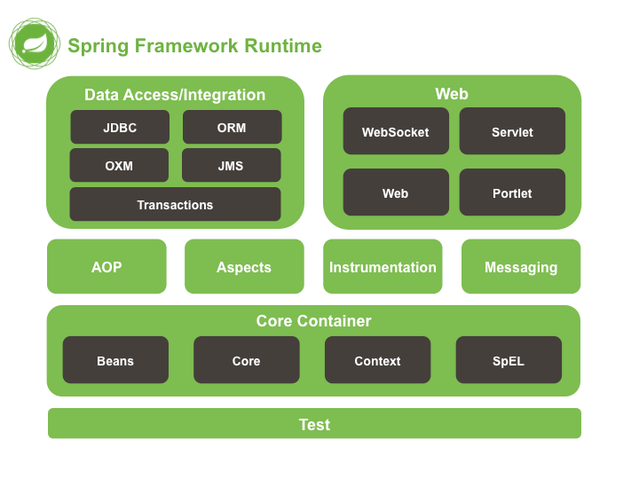
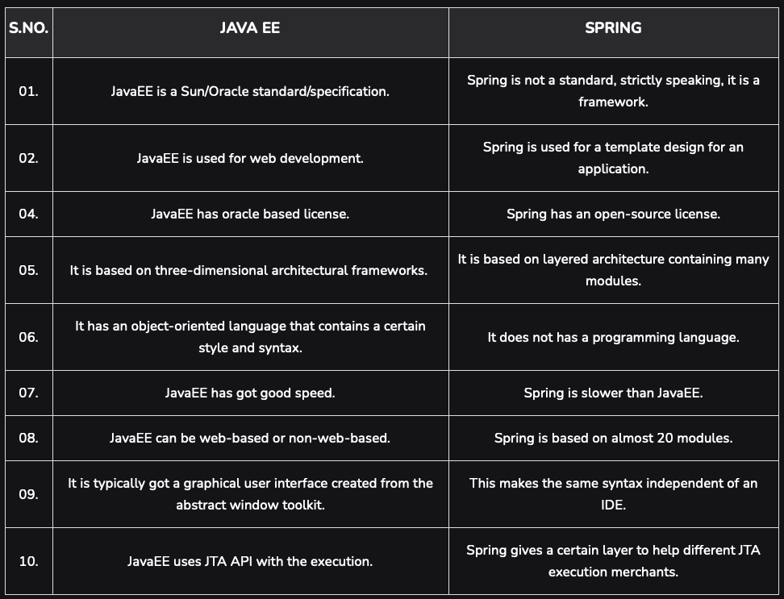
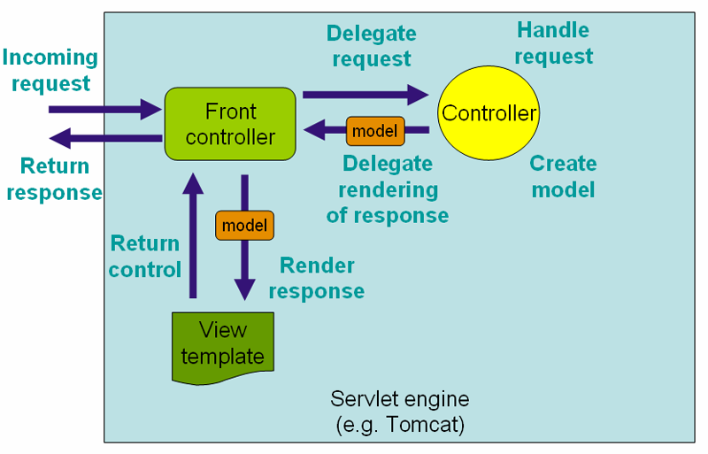

# Enterprise module (Java branch)

### Java Enterprise and Spring

#### What are the possible uses of `Java Reflection` ?

Reflection in Java allows for programmatic access to information about the fields, methods, and constructors of loaded
classes. It can be used for inspecting classes, interfaces, fields, and methods at runtime, creating new instances of
objects, invoking methods, and changing field values.

```java
import java.lang.reflect.*;

public class DumpMethods {
    public static void main(String[] args) {
        try {
            Class c = Class.forName(args[0]);
            Method m[] = c.getDeclaredMethods();
            for (int i = 0; i < m.length; i++)
                System.out.println(m[i].toString());
        } catch (Throwable e) {
            System.err.println(e);
        }
    }
}
```

#### What is `Spring Framework` ?

Spring is a comprehensive, powerful, open-source framework for enterprise Java development. With a wide range of
capabilities, Spring simplifies Java development and promotes good design practices. Spring enables the creation of
high-performing, reusable, and scalable applications. It provides infrastructure support, so developers can focus on
business logic. Spring has a wide range of useful modules (about 20), such as Core, JDBC or Web. Each module contains
well-organized features which you can use based on the application requirements.



#### What is `Spring Boot` ?

Spring Boot is a project that simplifies the development of applications based on the Spring framework, promoting
`convention over configuration`. It simplifies dependency management, configuration, and runtime environment setup,
making it easier to build stand-alone, production-grade Spring-based applications. The main goal of Spring Boot is to
reduce development time and difficulty of configurations.

`Spring Boot`:

- is a lightweight framework
- is easy to get started quickly with
- is a perfect choice if you want to avoid XML configurations
- has default setup for unit and integration tests

### What is the major difference between the `Java Standard Edition (JSE)` and `Java Enterprise Edition (JEE)`?  <br/> You can choose `Spring (Spring Boot)` instead of JavaEE. Focus on comparing them.

- `Java Standard Edition (JSE)` is the core Java programming platform, providing APIs for basic functionalities.
- `Java Enterprise Edition (JavaEE)`, or alternatively Spring, extends JSE by providing APIs and frameworks, catering
  to the needs of enterprise-scale applications.
- `Spring Boot`: further simplifies Spring application development, reducing the need
  for extensive configuration and setup.



#### What are the `advantages of the Spring Framework` ? Focus on the Core part.

The Core part of Spring Framework provides fundamental parts of the framework including `IoC and Dependency Injection`
which promotes loose coupling, thereby making components easy to test and integrate. It also helps in managing the life
cycle of the objects, promoting design principles like SOLID and making applications more modular, maintainable, and
efficient.

#### What is a `servlet`? What is the purpose of DispatcherServlet in Spring ?

A servlet is a `Java class that handles requests, processes them, and replies with a response`. In Spring,
`DispatcherServlet` acts as a front controller, receiving incoming requests and dispatching them to the appropriate
handlers (`controllers`). It plays a crucial role in `Spring MVC's workflow` by managing the flow of request and
response.\
Essentially, a `DispatcherServlet handles an incoming HttpRequest, delegates the request, and processes that
request according to the configured HandlerAdapter interfaces` that have been implemented within the Spring application
along with accompanying annotations specifying handlers, controller endpoints, and response objects.
The `@RequestMapping`annotation sets the specific endpoint at which a handler will be available within the
WebApplicationContext associated with it.

```java

@Controller
@RequestMapping("/user")
@ResponseBody
public class UserController {

    @GetMapping("/example")
    public User fetchUserExample() {
        // ...
    }
}
```



#### When do you use `RestControllers`, when just simple `Controllers` ?

Use `@RestController` when you are building a `RESTful web service`, and it is mainly used to send data in `JSON or XML`
format.\
`@Controller` is used when you are creating a traditional web application and want to return a view, and it is
generally `used in combination with Thymeleaf` or JSPs.
The @RestController annotation is a combination of the @Controller and @ResponseBody annotations and you can use it to
implement REST APIs in Java and Spring Boot.

The key difference between `@Controller` and `@RestController` annotation is the `@ResponseBody`
annotation, `@Controller`does not automatically add the @ResponseBody annotation to all the controller’s methods, 
which means that you need to add it to each method individually if you want to return a JSON or XML response. 
`@RestController` automatically adds the `@ResponseBody` annotation to all the controller’s methods.

```java
@Controller
public class MyController {

    @Autowired
    private MyService myService;

    @RequestMapping("/hello")
    public String sayHello(Model model) {
        model.addAttribute("message", myService.getHelloMessage());
        return "hello";
    }
}
```

```java
@RestController
public class MyRestController {

    @Autowired
    private MyService myService;

    @RequestMapping("/greeting")
    public Greeting getGreeting() {
        return myService.getGreeting();
    }
}
```

<div style="text-align:center;">

</div>

#### What is `Spring Application Context` ?

`The primary job of the ApplicationContext is to manage beans`.\
The `Spring Application Context is a centralized interface for configuring and managing Spring beans`, it represents the
`IoC container`. It holds the configuration and state for your application and is `responsible for instantiating,
configuring, and assembling beans`, managing their lifecycle, and providing access to them as needed.\
`IoC (Inversion of Control) Container` is a framework for implementing automatic dependency injection. We can call them
`DI Containers` as well, which name shows better their actual use.\
In traditional programming, our custom code makes calls to a library, IoC enables `a framework to take control of the
flow of a program and make calls` to our custom code. To enable this, frameworks use abstractions with additional
behavior built in.\
`Beans` are objects that are instantiated, assembled and managed by a Spring IoC Container.

```java
ApplicationContext container=new ClassPathXmlApplicationContext("appContext.xml");
```

#### What are the main ways to `define a bean in the Application Context` ?

Beans in the Application Context can be defined using annotations like `@Component`, `XML configuration`,
or `Java-based`configuration using `@Bean annotation`. These different approaches give developers flexibility and
control over how beans are defined, configured, and managed within the application.

1. `Java-Based Configuration`: @Bean annotation, @Configuration class. This is the newest, from Spring 3.0.
2. `Annotation-Based Configuration`: @Component, @Controller, @Service, @Repository, @Autowired. Since Spring 2.5.
3. `XML-Based Configuration`: Traditional way. We do all bean mappings in an XML configuration file.

#### Difference between `.jar and .war files` ?

A .jar file (Java Archive) is used for packaging Java classes and associated resources, whereas a .war file (Web
Application Archive) is used specifically for packaging web applications. .war files include JSP, HTML, JavaScript, and
other resources needed for the web application in addition to Java classes.

#### What are the major differences between `Maven, Ant and Gradle` ?

`Maven, Ant, and Gradle are build automation tools`. Maven uses convention over configuration and XML files for defining
builds, Ant provides procedural build scripts, and Gradle offers a powerful and flexible build system with a DSL based
on Groovy or Kotlin. Gradle combines the best features of both, allowing for convention over configuration when needed,
and flexibility for custom-builds.

#### What is `Maven` used for?

Maven is a build automation and software project management and comprehension tool, primarily used for managing
project's build lifecycle and dependencies. It simplifies the build process by providing a standard build lifecycle
and dependency management, allowing developers to focus more on writing code.

- `Project Object Model (POM)`: Maven uses a POM file (pom.xml) to describe the project configuration, dependencies, and
  build settings. This file serves as the project's blueprint.
- `Dependency Management`: Maven simplifies the management of project dependencies. It can automatically download and
  manage libraries and frameworks from remote repositories, making it easier to share and reuse code.
- `Build Lifecycle`: Maven defines a standard build lifecycle with phases such as compile, test, package, install, and
  deploy. Developers can execute these phases to build, test, and package their projects.
- `Centralized Repository`: Maven central repository is a central hub for storing and sharing Java libraries and
  artifacts. Maven can automatically download dependencies from this repository.

#### What does a `pom.xml` file contains in Maven?

The `pom.xml file in Maven` contains project information, configuration details, plugin management, and dependency
lists,
defining how the project is built, its dependencies, and other crucial aspects like goals and phases.

### Object Relational Mapping, JPA, Hibernate

#### What is an `ORM`? What are the benefits, when to use?

`Object-Relational Mapping (ORM)` is a programming technique that allows developers to `interact with a relational
database using an object-oriented programming language`. It is beneficial as it allows developers to interact with
databases using higher-level programming constructs and abstracts away the need for SQL in many cases. It should be
used when there is a clear advantage in terms of development speed and maintainability over using plain SQL.

#### What is the difference between `JDBC and JPA`? Which are the advantages and disadvantages of each? Give a general overview.

JDBC is a low-level API for executing SQL and handling database connections, while JPA is a higher-level specification
for accessing, persisting, and managing data between Java objects and relational databases. JPA allows for cleaner, more
maintainable code but may introduce overhead and be less performant for certain use cases compared to JDBC.

`JDBC (Java Database Connectivity):`

- Low-level API
- Direct SQL queries: need to write SQL queries
- Connection centric: need to manage connection manually
- More code

`JPA (Java Persistence API):`

- High-level API
- Object-Relational Mapping (ORM): JPA facilitates ORM, where Java objects are mapped to database tables, and
  interactions are done through these objects.
- Less code

#### What is `Hibernate`? What are the advantages, limitations ?

`Definition:`\
Hibernate is an open-source `Object-Relational Mapping (ORM)` framework for Java applications. It facilitates the
mapping of an object-oriented domain model to a traditional relational database, allowing developers to interact with
databases using Java objects rather than SQL. Hibernate implements the Java Persistence API (JPA) specifications.

`Advantages:`

- `Abstraction of Database Specifics:`\
  Hibernate abstracts the application from the underlying SQL database, allowing developers to focus on business logic
  without concerning themselves with database-specific details.
- `Improved Productivity and Maintainability:`\
  By allowing developers to interact with databases using Java objects, Hibernate speeds up development and enhances
  code
  maintainability and readability.
- `Performance Optimization:`\
  Hibernate offers various optimization techniques such as Lazy Loading, Caching, and Batch Processing, to improve the
  performance of database access.
- `Declarative Transaction Management:`\
  Hibernate provides a declarative transaction management service that can be customized to meet specific requirements.
- `Automatic Table Generation:`\
  Hibernate can automatically generate SQL tables based on Java classes, reducing the manual effort required in database
  schema creation.
- `Scalability:`\
  Hibernate supports a scalable architecture, making it suitable for both small and large enterprise applications.
- `Database Independence:`\
  Applications using Hibernate can switch between different databases with minimal changes, promoting database
  independence.

`Limitations:`

- `Complexity:`\
  Hibernate’s feature-rich nature and wide array of configurations can be overwhelming and may lead to unnecessary
  complexity in simple CRUD applications.
- `Learning Curve:`\
  Understanding and mastering Hibernate, including its advanced features and optimizations, can be challenging,
  particularly for beginners.
- `Performance Overhead:`\
  The abstraction and the additional processing layer introduced by Hibernate can sometimes lead to performance
  overhead,
  particularly for applications with extensive database interactions.
- `Not Suitable for All Types of Projects`:\
  While Hibernate is powerful, it may not be the best choice for projects with unique storage requirements, simple
  database interactions, or when high-performance, lightweight solutions are needed.
- `Debugging:`\
  Debugging Hibernate applications, particularly issues related to SQL generation and transaction management, can be
  challenging and time-consuming.

In conclusion, while Hibernate is a powerful ORM tool with many advantages, it has its limitations and may not be
suitable for every project. Careful consideration of the project requirements and constraints is crucial when deciding
whether to use Hibernate.

<div style="text-align:center;">

</div>

#### Name 3 different `annotations used in JPA`, what can they do for you ?

- `@Entity`: used to mark a class as a persistent entity.
- `@Table` specifies the table that the entity is mapped to.
- `@Id` designates a field as the primary key of the entity.

These annotations help in mapping Java objects to database tables, defining entities and their relationships
in the database.

#### What is `object-relational impedance mismatch` ?

Object-relational impedance mismatch arises from the fundamental differences between the object-oriented programming
paradigm and the relational database paradigm. It's the challenge encountered when trying to map objects to relational
databases, due to the differing ways they represent data and relationships.

- `Data Model Mismatch`:
    - Object-Oriented Model: In object-oriented programming, data is represented as objects with attributes and methods.
      Objects can have complex relationships and hierarchies.
    - Relational Model: In relational databases, data is organized into tables with rows and columns. Relationships are
      typically represented using foreign keys.
- `Inheritance and Polymorphism`:
    - Object-Oriented: Concepts like inheritance and polymorphism are fundamental in object-oriented languages.
    - Relational: Representing inheritance and polymorphism in a relational schema can be challenging and may require
      additional tables or complex mapping strategies.

#### What is a `JpaRepository` ? What are the 2 main methods to define queries in them?

JpaRepository is a JPA specific extension of Repository in Spring Data, providing functionalities like CRUD operations,
pagination, and sorting. Developers can define `queries using method names` or `@Query annotations`, allowing for
concise
and expressive data access code.

1. `Query Methods`:

```java
public interface UserRepository extends JpaRepository<User, Long> {
    List<User> findByFirstName(String firstName);

    List<User> findByLastNameAndAge(String lastName, int age);
}
```

2. `@Query Annotation`:

```java
public interface UserRepository extends JpaRepository<User, Long> {
    @Query("SELECT u FROM User u WHERE u.email = :email")
        // using JPQL query in this method
    User findByEmail(@Param("email") String email);
}
```

#### Why is the Set preferred over List when we want to store `OneToMany relations` ?

Set is preferred over List in OneToMany relations `to avoid redundancy as Set does not allow duplicate elements`. Using
Set can prevent issues related to duplicate and unordered data, ensuring data integrity and consistency in
relationships.

#### What kind of `inheritance strategies` are available? Which annotations are used to solve this?

JPA supports multiple inheritance strategies like SINGLE_TABLE, `JOINED`, and TABLE_PER_CLASS, configured using the
`@Inheritance annotation`. These strategies dictate how entities and their subclasses are mapped to the database tables,
providing flexibility in representing object hierarchies in relational databases.
