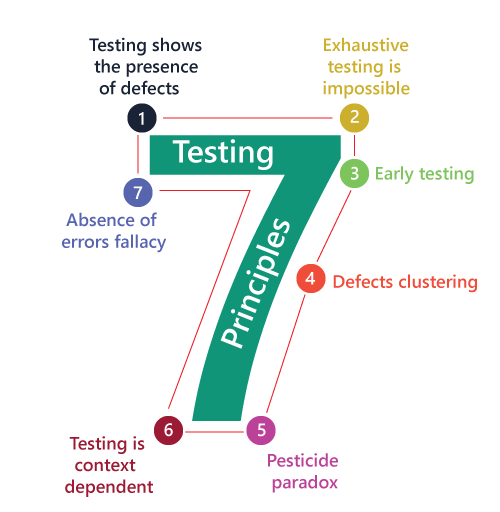

# Test automation questions

### Testing Basics (ISTQB related)

#### What is the purpose of testing? What is not?

**Software testing is a way to assess the quality of the software and to reduce the risk of software failure in
operation.**
\
A **common misperception of testing is that it only consists of running tests**, i.e., executing the software and
checking
the results.
But test execution is only one from the many testing activities.

**The test process also includes activities such as**:

- test planning,
- analyzing,
- designing, and
- implementing tests,
- reporting test progress and results, and
- evaluating the quality of a test object.

**Dynamic Testing:**
Some testing does involve the execution of the component or system being tested; such testing is called **dynamic
testing**.

**Static Testing:**
Other testing does not involve the execution of the component or system being tested; such testing is called **static
testing**.

Another **common misperception of testing is that it focuses entirely on verification of requirements, user stories, or
other specifications**.
While testing does involve checking whether the system meets specified requirements, **it also
involves validation**, which is checking whether the system will meet user and other stakeholder needs in its
operational environment(s).

**Typical Objectives of Testing**:

- To prevent defects by evaluating work products such as requirements, user stories, design, and code
- To verify whether all specified requirements have been fulfilled
- To check whether the test object is complete and validate if it works as the users and other
  stakeholders expect
- To build confidence in the level of quality of the test object
- To find defects and failures by reducing the level of risk of inadequate software quality
- To provide sufficient information to stakeholders to allow them to make informed decisions, especially regarding the
  level of quality of the test object
- To comply with contractual, legal, or regulatory requirements or standards, and/or to verify the test object’s
  compliance with such requirements or standards

#### What is the difference between Defect, Error, Failure?

1. **Error**: A `mistake in coding` is called an `Error`.
2. **Defect**: An `error found` by a tester is called a `Defect`.
3. **Failure**: The `build does not meet the requirements`, then it is `Failure`.

See for more
details: https://farhan-labib.medium.com/the-confusion-error-vs-fault-vs-bug-vs-defect-vs-failure-c557af04726b

**Errors may occur for many reasons, such as**:

- Time pressure
- Human fallibility
- Inexperienced or insufficiently skilled project participants
- Miscommunication between project participants, including miscommunication about requirements and design
- Complexity of the code, design, architecture, the underlying problem to be solved, and/or the technologies used
- Misunderstandings about intra-system and inter-system interfaces, especially when such intra-system and inter-system
  interactions are large
- New, unfamiliar technologies

#### What are the testing principles?

1. **Testing shows the presence of defects, not their absence** *“We can never say that our system is defect free”* \
   Testing can show that defects are present, but cannot prove that there are no defects. Testing reduces the
   probability of undiscovered defects remaining in the software but, even if no defects are found, testing is not a
   proof of correctness.
2. **Exhaustive testing is impossible** *“Impossible to test everything”* \
   Testing everything (all combinations of inputs and preconditions) is not feasible except for trivial cases. Rather
   than attempting to test exhaustively, risk analysis, test techniques, and priorities should be used to focus test
   efforts.
3. **Early testing saves time and money** *“We can talk about the Effectiveness of testing”* \
   To find defects early, both static and dynamic test activities should be started as early as possible in the software
   development lifecycle. Early testing is sometimes referred to as a shift left. Testing early in the software
   development lifecycle helps reduce or eliminate costly changes (see section 3.1).
4. **Defects cluster together** \
   A small number of modules usually contains most of the defects discovered during pre-release testing, or is
   responsible for most of the operational failures. Predicted defect clusters, and the actual observed defect clusters
   in test or operation, are an important input into a risk analysis used to focus the test effort (as mentioned in
   principle 2).
5. **Beware of the pesticide paradox** \
   If the same tests are repeated over and over again, eventually these tests no longer find any new defects. To detect
   new defects, existing tests and test data may need changing, and new tests may need to be written. (Tests are no
   longer effective at finding defects, just as pesticides are no longer effective at killing insects after a while.) In
   some cases, such as automated regression testing, the pesticide paradox has a beneficial outcome, which is the
   relatively low number of regression defects.
6. **Testing is context dependent** \
   Testing is done differently in different contexts. For example, safety-critical industrial control software is tested
   differently from an e-commerce mobile app. As another example, testing in an Agile project is done differently than
   testing in a sequential software development lifecycle project (see section 2.1).
7. **Absence-of-errors is a fallacy** \
   Some organizations expect that testers can run all possible tests and find all possible defects, but principles 2 and
   1, respectively, tell us that this is impossible. Further, it is a fallacy (i.e., a mistaken belief) to expect that
   just finding and fixing a large number of defects will ensure the success of a system. For example, thoroughly
   testing all specified requirements and fixing all defects found could still produce a system that is difficult to
   use, that does not fulfill the users’ needs and expectations, or that is inferior compared to other competing
   systems.

See more details: https://medium.com/@ruwanthiranasinghe1996/7-principles-of-software-testing-25ba867f75ea

#### What is unit testing? Who is responsible for write unit tests?

#### What are Test Levels, what is the difference between them?

#### What is the difference between verification and validation?

#### What are Testing Types, what is the difference between them?

#### What is the difference between white box, grey boy and black box testing?

#### What is the difference between UAT (User Acceptance Testing) and System testing?

#### Mention the differences between Regression Testing, Smoke Testing and Retesting?

#### What is risk-based testing, what's the point of it?

#### What is the difference between Static and Dynamic Testing?

#### Compare V-modell, Waterfall, Agile from testing perspective!

#### What would you test in case of a simple webshop purchasing function (put items to cart, buy them)? Plan and reason your tests.

### Reporting, Bugs

#### What steps would you follow when you find a defect?

#### Talk about common test reports, and about their details.

#### What does a bug report contain?

#### How would you prioritize a bug?

### Test Automation, Selenium

#### Which testcases should be automated and which shouldn't?

#### Describe a good automated test!

#### What is Selenium, Selenium IDE, Selenium WebDriver?

#### How can be web elements identified?

#### How can you wait for elements, what can go wrong? Collect possible errors and root causes.

#### Compare POM and Keyword Driven Testing!

#### What's the difference between TDD and BDD?

#### What is API testing and why would you use that?

#### What is Data Driven Testing and why is it useful?

#### What are the challenges and best practices with dynamically loading web elements?

#### What are the challenges of Mobile Test Automation?

### Advanced Topics

#### What is the difference between CI and CD?

#### Describe a Continuous Delivery!

#### Compare two popular CI systems, one of them should be Jenkins!

#### What is Docker, why is it useful?

#### Compare two popular Test Automation IDEs, one of them should be the Katalon Studio!
