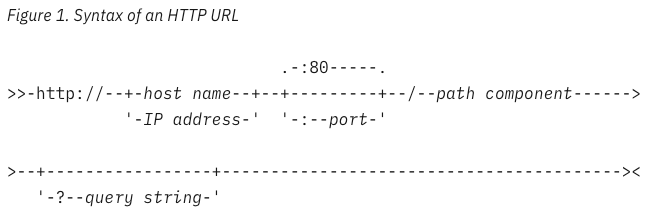

# OOP Basics with Java questions

## Java ecosystem

#### What is the `JVM`?

A `Java virtual machine` (JVM) is a virtual machine that enables a computer to run Java programs as well as programs
written in other languages that are also compiled to Java bytecode.
Java Virtual Machines serve two primary purposes:
(1) First is to provide a means for a Java program to run in any environment.
(2) Second is to maintain and optimize program memory.

#### What does `Java compilation` mean?

It converts source code into an intermediate file known as a bytecode file. The fact that every type of OS uses a
different bytecode file allows for platform independence. A `Java compiler converts` the entire source code into a
machine-code file or other intermediate code, which is then executed.

#### What is `Java bytecode`?

`Bytecode` in Java is a set of instructions for the Java Virtual Machine (JVM). Bytecode is a platform-independent code.
Bytecode is a code that lies between low-level language and high-level language. After the Java code is compiled, the
bytecode gets generated, which can be executed on any machine using JVM.

#### What is the difference between the `JRE and the JDK`?

`Java Development Kit` (JDK) is for development purpose whereas `Java Runtime Environment` (JRE) is for running the java
programs.
JDK and JRE both contains JVM so that we can run our java program.
(1) JDK is for development purpose whereas JRE is for running the java programs.
(2) JDK and JRE both contains JVM so that we can run our java program.
(3 )JVM is the heart of java programming language and provides platform independence.

#### What is the `Iterable` interface?

The `Iterable` interface is a core interface in Java that is part of the `Java Collections Framework`. It is designed to
represent a sequence of elements and provides the ability to iterate over those elements. The `Iterable` interface is
implemented by classes that want to support iteration, enabling them to be used in enhanced for loops and other
operations that require iteration.

#### What is the `Collection` interface?

The `Collection` interface is a fundamental interface in the `Java Collections Framework` that represents a group of
objects, known as elements. It provides a set of methods to manipulate and operate on collections of elements. The
`Collection` interface extends the `Iterable` interface, allowing collections to be iterated over using enhanced for
loops and other iteration mechanisms.

#### What is the `Map` interface?

The `Map` interface is a fundamental interface in the `Java Collections Framework` that represents a mapping between
`keys and values`. It provides methods to manipulate and retrieve values based on their associated keys. Unlike the
`Collection` interface, which deals with individual elements, the `'Map' interface works with key-value pairs`.

#### Compare sets, lists, and queues in Java.

`Set` in Java is an interface declared in java.util package. It extends the `Collection` interface that allows creating
an unordered collection or list, where duplicate values are not allowed. As the name implies, a set in Java is used to
create a mathematical set.

Java `List` is an ordered collection. Java `List` is an interface that extends `Collection` interface. Java List
provides control over the position where you can insert an element. You can access elements by their index and also
search elements in the list.

Java `Queue` represents an ordered list of elements. Java Queue follows `FIFO` order to insert and remove its elements.
FIFO stands for `First In First Out`. Java Queue supports all methods of `Collection` interface. Most frequently used
Queue implementations are LinkedList, ArrayBlockingQueue and PriorityQueue.

#### Compare `ArrayList` and `LinkedList` in Java.

`ArrayList` is efficient for random access, retrieval by index, and overall faster iteration, while `LinkedList` is
more efficient for frequent insertions and deletions. The choice between them depends on the specific requirements of
your application, such as the type of operations performed, the size of the list, and the access patterns.
`ARRAYLIST`: 
`LINKEDLIST`: 

#### Are sets sorted in Java?

`HashSet`: This implementation does not maintain any specific order for its elements. The order in which elements are
stored and retrieved may vary and is not predictable. It provides constant-time performance for adding, removing, and
checking for the presence of elements.

`TreeSet`: This implementation maintains the elements in sorted order according to their natural ordering (if the
elements implement the 'Comparable' interface) or a specified comparator. The elements are stored in a binary search
tree data structure, allowing efficient access and operations with a logarithmic time complexity.

`LinkedHashSet`: This implementation maintains the elements in the order in which they were added. It combines the
functionality of a hash table and a linked list, ensuring predictable iteration order. LinkedHashSet provides
constant-time performance for adding, removing, and checking for element existence, similar to HashSet

## Language features

#### What `control statements` are available in Java?

`Decision-Making statements` (Conditional statements): if statements, if-else statement, switch statement
`Looping statements`: do while loop, while loop, for loop, enhanced for-each loop
`Control transfer statements`: break statement, continue statement, return statement

#### Compare the `different looping constructs` in Java.

`For Loop`:
Syntax: for (statement 1; statement 2; statement 3) { // code }
Best used when you `know the exact number of iterations in advance` or need to iterate over a range of values.
Allows you to initialize a loop control variable, set the termination condition, and specify how the variable is updated
after each iteration.
Typically used when the number of iterations is known beforehand.

`While Loop`:
Syntax: while (condition) { // code }
Best used when the exact number of iterations is not known beforehand and `depends on a condition`.
The loop continues as long as the `specified condition is true`.
Suitable for cases where the loop may not execute at all if the condition is false from the start.

`Do-While Loop`:
Syntax: do { // code } while (condition);
Similar to the while loop but guarantees the execution of the loop body at least once, even if the condition is false
from the beginning.
Suitable when you need to execute a block of code at least once before checking the loop condition.

`Enhanced For Loop` (For-Each):
Syntax: for (type variable : collection) { // code }
Designed for iterating over elements in arrays and collections (objects that implement the `Iterable interface`).
Simplifies the syntax and is easier to read for iterating over the elements of an array or collection without dealing
with an explicit loop counter.

#### Compare the `different conditional constructs` in Java.

`If / if-else / if-else if else`:
Best used when you need to execute one block of code if a condition is true and another block of code if the condition
is false. Provides a simple way to handle two mutually exclusive cases.

`Switch-case`:
Best used when you have multiple distinct cases based on the value of an expression.
Simplifies the syntax when dealing with multiple if-else if conditions.
Suitable for handling discrete values or enumerations.

`Ternary Operator`:
Syntax: variable = (condition) ? valueIfTrue : valueIfFalse;
Best used for simple, short expressions where you need to choose between two values based on a condition.
Provides a concise way to assign one of two values to a variable based on a condition.

#### What is a `while` loop?

A `while loop` is a control flow statement in Java that allows you to repeatedly
execute a block of code as long as a specified condition is true. The loop continues to execute as long as the
condition remains true, and it terminates when the condition becomes false.

#### How do you manually break out of a loop?

To manually break out of a loop in Java, you can use the `break statement`. The break statement allows you to exit the
loop prematurely, even if the loop's condition is still true. It is commonly used within loops to stop the iteration
based on a specific condition.

#### What does the `var` keyword mean?

The `var` keyword is a feature introduced in Java 10 as part of the Java Language Specification (JLS). It is a local
variable type inference, allowing you to declare and initialize variables without explicitly specifying their types.
Instead, the type is inferred based on the expression used to initialize the variable.

#### What are _`lambda expressions`_? How are they used in Java development?

`Lambda expressions` are a feature introduced in Java 8 as part of the Java Language Specification (JLS). They provide a
concise way to represent `anonymous functions`, also known as functional interfaces. Lambda expressions allow you to
treat functionality as a method argument or code as data, enabling functional-style programming in Java.

## Type system

#### What are `primitive types` in Java? Give some examples.

`Primitive Data Type`: In Java, the primitive data types are the predefined data types of Java. They specify the size
and type of any standard values. Java has `8 primitive data types`
namely `byte`, `short`, `int`, `long`, `float`, `double`, `char` and`boolean`.

#### What is the `difference between primitive types and reference types`?

`Primitive Types`: Primitive types store their values directly in memory. When you declare a variable of a primitive
type, the actual value is stored in that variable. For example, int x = 10; assigns the value 10 directly to the
variable x.
`Reference Types`: Reference types, on the other hand, store references (memory addresses) to objects rather than the
actual object itself. When you declare a variable of a reference type, the variable contains the memory address where
the object is stored. Objects are created on the heap, and the reference points to the object's location. For example,
String str = new String("Hello"); stores the reference to the String object on the heap, and str contains the memory
address of that object.

#### What is a `class` in Java?

In Java, a `class` is a `blueprint` or a template that defines the structure and behavior of objects. It serves as a
model for creating instances of objects with specific attributes (data members) and behaviors (methods). A class
encapsulates data and methods that operate on that data, allowing objects to be created based on its definition.

#### What is `an object` in Java?

In Java, an object is `an instance` of a class—a concrete realization of the blueprint or template defined by that
class. Objects are the core building blocks of object-oriented programming, allowing you to represent and manipulate
data in a structured way. Each object has its own set of data members (also called `fields`) and associated `methods` (
functions) that define its behavior.

#### What is a `constructor`?

In Java, a constructor is a `special method` with the same name as the class that is used to create and initialize
objects of that class. It is called when an object is created using the new keyword and is responsible for setting
initial values to the object's data members (fields). Constructors play a crucial role in the process of creating
objects and preparing them for use.

#### What is an `enum` in Java?

In Java, an `enum` (short for enumeration) is a special data type used to define a `fixed set of constant values`. It is
a list of named constants, and each constant represents a specific, pre-defined value. enum types provide a way to
represent a set of related named constants as a single, named data type.

#### Explain the difference between a `class and an enum`.

`Purpose`:
`Class`: A class is a blueprint or template that defines the structure and behavior of objects. It can have data
members (fields) to represent object attributes and methods to define object behavior.
`Enum`: An enum, short for enumeration, is a special data type used to define a fixed set of named constants. It
represents a set of related constant values as a single data type.

`Contents`:
`Class`: A class can contain data members, methods, constructors, and other members like static blocks or nested
classes. It is versatile and can be used to represent various objects and behaviors.
`Enum`: An enum contains a list of named constants. Each constant is an instance of the enum type and is implicitly a
public, static, and final field. Enums can also have fields, methods, and constructors just like regular classes.

`Instantiation`:
`Class`: Objects of a class are created using the new keyword followed by a constructor call. A class can have multiple
instances, each representing a unique object.
`Enum`: Enum constants are predefined and fixed. You cannot create new instances of an enum at runtime. The set of enum
constants is known and defined at compile-time.

`Use Cases`:
`Class`: Classes are used to model real-world entities, implement complex data structures, encapsulate behavior, and
support object-oriented principles like inheritance and polymorphism.
`Enum`: Enums are used to represent a fixed set of related constants, such as days of the week, months, card suits, and
other types where a predefined, limited set of values is appropriate.

`Memory Representation`:
`Class`: Each instance of a class consumes memory to store its data members and methods. Classes can have multiple
instances with different data.
`Enum`: Enum constants are stored as static fields and only once in memory. Each constant represents a unique instance
of the enum type.

#### Explain the difference between a class and a `record`.

`Records` provide a more concise and less error-prone way to create simple data classes that mainly serve as `data
containers`. When you need a class to store and access data `without complex behavior` and with built-in immutability,
using a record can significantly reduce boilerplate code and improve code readability. However, when additional
behaviors beyond data storage are required, classes are still the more appropriate choice.

#### What are `interfaces`? Why should we use them?

In Java, an `interface` is a reference type that defines a contract or a `set of abstract methods and constants` that a
class `must implement`. It serves as a `blueprint` for classes, specifying what methods a class should have without
providing the implementation details. As one of Java's core concepts, abstraction, polymorphism, and multiple
inheritance are supported through this technology. Interfaces are used in Java to achieve abstraction

#### What is `INHERITANCE`?

`Inheritance` is a fundamental concept in object-oriented programming (`OOP`) that allows a class (called the `subclass`
or derived class) to inherit the properties and behaviors of another class (called the `superclass` or base class). The
`subclass inherits the fields and methods of the superclass`, which means it can reuse the code and functionality
defined in the superclass without having to rewrite it.

#### Is `multiple inheritance` allowed in Java?

No, Java does `not support` multiple inheritance of classes. Multiple inheritance is a feature in object-oriented
programming that allows a class to inherit from more than one superclass. However, Java only supports single
inheritance, which means a class can have only one direct superclass.

The decision to disallow multiple inheritance in Java was made to avoid the "diamond problem," which is a conflict that
can arise when a class inherits from two or more classes that have a common superclass. This can lead to ambiguity in
method resolution, and it complicates the language and type system.

To address the need for multiple inheritance of behavior, Java introduced the concept of interfaces. An interface is a
reference type that can have abstract methods and constants. A `class can implement multiple interfaces`, effectively
`providing a form of multiple inheritance` through interfaces.

#### What is a `static` class member?

In Java, a `static` class member is a member (field or method) that `belongs to the class itself` rather than to
individual instances (objects) of the class. It is shared by all instances of the class and can be accessed directly
using the class name, without the need to create an object of the class. The static keyword is used to declare static
class members.

#### Can a static method use non-static members?

No, a static method `cannot directly access non-static` (instance) members of a class. Static methods are class-level
methods that do not operate on any specific instance of the class, and they can only access other static members (
static fields and static methods) within the class.

The reason for this limitation is that static methods are not associated with any particular instance of the class. They
exist at the class level, and their execution is not dependent on the state of individual objects. Therefore, they do
not have access to instance-specific data, as that data is tied to a specific object.

If a static method needs to operate on instance-specific data, it must be provided with the instance (object) as a
parameter. By passing an instance to the static method, it can access and work with the instance-specific data through
that parameter.

#### What does the `final` keyword mean in Java?

The `final keyword` is useful for ensuring `immutability`, providing security in certain contexts, and preventing
unintended changes to critical variables, methods, or classes in your Java code. It also allows the Java compiler and
runtime to perform optimizations and enforce certain constraints, making the code more robust and reliable.

#### What does the `abstract` keyword mean in Java?

In Java, the `abstract keyword` is used to indicate that a class or a method is abstract, which means it cannot be
instantiated or must be implemented in subclasses, respectively. The abstract keyword is a modifier that provides a
way to create abstract classes and define abstract methods within those classes.

#### What is _`overloading`_ in Java?

In Java, method overloading is a feature that allows a class to `have multiple methods with the same name`
but `different
parameter lists`. It provides a way to define multiple methods within the same class that perform similar actions but
with different inputs or data types. Method overloading allows the same method name to be reused with varying
parameters, providing a more intuitive and flexible API for users of the class.

#### What is _`overriding`_ in Java?

In Java, method overriding is a feature that allows a subclass to provide a specific implementation for a method that
is already defined in its superclass. When a subclass overrides a method, it replaces the original implementation
inherited from the superclass with its own implementation. Method overriding allows a subclass to provide a
specialized behavior while still maintaining the same method signature as the superclass.

#### What is the difference between `overloading and overriding`?

In summary, `method overloading` allows a class to define multiple methods with the same name but different parameter
lists, while `method overriding` occurs when a subclass provides a specific implementation for a method that is already
defined in its superclass. Overloading is not dependent on inheritance and is used for providing different versions of
methods within a class, whereas overriding is dependent on inheritance and is used to specialize methods in subclasses
while maintaining a common interface with the superclass.

#### What is `null`?

In Java, `null` is a special literal that represents the absence of a value or the lack of an object reference. It is a
`keyword` that serves as a placeholder to indicate that a variable or reference does not point to any object in memory.
When a variable is assigned the value null, it means that the variable does not currently reference any object on the
heap.

#### Compare the `access modifiers` in Java.

`Private`: The access level of a private modifier is only within the class. It cannot be accessed from outside the
class.

`Default (Package-Private)`: The access level of a default modifier is only within the package. It cannot be accessed
from outside the package. If you do not specify any access level, it will be the default.

`Protected`: The access level of a protected modifier is within the package and outside the package through child class.
If you do not make the child class, it cannot be accessed from outside the package.

`Public`: The access level of a public modifier is everywhere. It can be accessed from within the class, outside the
class, within the package and outside the package.

#### What is the `default access modifier` in a class?

In Java, if `no access modifier` is explicitly specified for a class, field, method, or constructor, it is considered to
have "default access" or "package-private" access. The default access modifier restricts the visibility of the class
or member to within the same package (i.e., all classes within the same package can access the member).

#### What is the purpose of the `equals()` method?

The `equals() `method in Java is used to `compare the content or value of two objects` to determine whether they are "
equal" or "equivalent." The purpose of the equals() method is to provide a way for developers to define what it means
for two objects of a class to be considered equal. By default, the equals() method in Java compares object references,
not the actual content of the objects. It checks whether `two references point to the same memory location` (i.e.,
whether they are the same instance of the class). However, in many cases, we want to compare objects based on their
content rather than their reference.

#### What is the difference between `==` and `equals()`?

`== Operator`:
The == operator is used for `reference comparison`. It checks whether two object references point to the same memory
location, i.e., whether they are referring to the same instance of an object.
When applied to objects, == compares their memory addresses, not their content. It simply checks if the two references
refer to the exact same object in memory.

`equals() Method`:
The equals() method is used for `content comparison`. It allows you to define custom logic to compare the content or
attributes of two objects to determine if they are considered equal based on the class's definition of equality.
By default, the equals() method is inherited from the Object class and performs the same reference comparison as the ==
operator, but it can be overridden in subclasses to provide custom content-based comparison.

#### What is the difference between `long` and `Long`?

`long (primitive data type)`:
long is a `primitive data type` in Java, and it is used to store 64-bit integer values.
It is a built-in data type and is part of the eight primitive data types supported by Java. The long data type is used
to represent whole numbers that can range from -9,223,372,036,854,775,808 to 9,223,372,036,854,775,807 (inclusive).
It is typically used when you need to work with large integer values that cannot be represented by the smaller integer
data types like int or short.

`Long (wrapper class for long)`:
Long is a `wrapper class` in Java that corresponds to the long primitive data type. It is part of the Java API and is
used to represent long values as objects.
Wrapper classes are used when you need to treat primitive data types as objects, for example, when working with
collections or using certain Java APIs that require objects rather than primitives.
`Long provides utility methods and constants that are not available in the primitive long data type`.

#### Which can store bigger numbers, `long` or `Long`?

Both long and Long can store the `same range of numbers`, which is -9,223,372,036,854,775,808 to
9,223,372,036,854,775,807 (inclusive) in Java. The key difference between them is their data type category,
but `long` can't store null. Attempting to assign null to a long variable will result in a compilation error.

#### What kind of packages do you know under `java.util.*` ? Bring at least 3 examples.

`Package java.util.*` contains:
(1) Collections Framework: ArrayList, LinkedList, HashMap (...)
(2) Date and Time: Date, Calendar, LocalDate (...)
(3) Miscellaneous Utilities: Scanner, Random, UUID (...)
...

## Architecture

#### Explain the `Single Responsibility Principle` (`SRP`).

"A class should have only one reason to change, meaning that a class should have only `one primary responsibility`."
In simpler terms, it suggests that `a class should be responsible for doing one thing and doing it well`. When a class
has multiple responsibilities, it becomes tightly coupled to different aspects of the system, making it more complex,
difficult to maintain, and harder to understand.

#### Explain the `Open/Closed Principle` (`OCP`).

"Classes should be `open for extension`, `closed for modification`."
In other words, you should not have to rewrite an existing class for implementing new features.

#### Explain the `Liskov Substitution Principle` (`LSP`).

"Subtypes (derived classes) `must be substitutable` for their base types (superclasses) without affecting the
correctness of the program."

#### Explain the `Interface Segregation Principle` (`ISP`).

"A class should `not be forced to implement` interfaces it doesn't use. Large interfaces should be `divided` into small
ones."

#### Explain the `Dependency Inversion Principle` (`DIP`).

"High-level modules should not depend on low-level modules. Both should `depend on abstractions`. Abstractions should
not depend on details. Details should depend on abstractions. Components should depend on abstractions,
not on concretions."

#### What is _`composition over inheritance`_?

"Composition over inheritance" is a `design principle` in object-oriented programming that suggests favoring
composition (`has-a relationship`) instead of inheritance (is-a relationship) to achieve code reuse and create more
flexible and maintainable software systems.

#### What is a `model class`?

The main purpose of a `model class` is to `encapsulate the data and behavior` related to a specific entity, object, or
data structure within the application. It contains attributes (data members) that represent the state of the entity
and methods (member functions) that define its behavior or operations.

#### What is a `service class`?

In software development, a `service class` is a type of class that `encapsulates specific functionality or
business logic`that is not directly related to representing entities (like model classes) or handling user interface
interactions (like controller classes). Service classes are commonly used to implement the business logic of an
application and provide services or operations that can be used by other parts of the application.

#### What do we mean by the `Gang of Four (GoF) Design Patterns`? Can you name some of these patterns?

The `Gang of Four` (GoF) Design Patterns refer to a set of 23 software design patterns described in the book "Design
Patterns: Elements of Reusable Object-Oriented Software." The book, often referred to as the "Gang of Four" book, was
written by Erich Gamma, Richard Helm, Ralph Johnson, and John Vlissides, who are collectively known as the "Gang of
Four" (GoF). The book was published in 1994 and has since become a seminal work in the field of software design and
architecture.

`e.g.:` Factory method, Abstract Factory, Singleton, Adapter.

#### What are the `risks` associated with `using the GoF` design patterns?

`Over-Engineering`
Increased Complexity
Learning Curve
Tight Coupling
Performance Overhead
Maintenance Challenges
Lack of Contextual Fit
`Over-Abstraction`

#### What do we mean by `YAGNI`?

YAGNI stands for `You Aren't Gonna Need It.` It is a software development principle that emphasizes avoiding
unnecessary or speculative functionality during the design and implementation of a system.

#### What do we mean by `SLAP`?

SLAP stands for `Single Level of Abstraction Principle.` It is a software design principle that advocates maintaining
a consistent level of abstraction within a method or function. The principle emphasizes that a method should either
contain high-level logic or low-level implementation details, but not a mix of both.

#### What do we mean by `KISS`?

KISS stands for `Keep It Simple, Stupid.` It is a principle in software design and development that advocates for
simplicity and straightforwardness in the design and implementation of code, systems, and solutions.

#### What is the `Repository Pattern`?

The Repository Pattern is a design pattern commonly used in software development to `separate the logic that retrieves
data from various data sources from the rest of the application's business logic`. It provides an abstraction layer
between the data access code and the business logic, making it easier to maintain and test the application.

#### What is a `CRUD interface`?

A CRUD interface is an interface or API (Application Programming Interface) that provides basic operations to `manage
data in a system`. The term "CRUD" stands for `Create, Read, Update, and Delete`, representing the four fundamental
operations that can be performed on data.

## Unit testing

#### Why is `unit testing` a good practice?

Unit testing is a good practice in software development for several compelling reasons. It is a fundamental aspect of
the software development process and plays a crucial role in `ensuring the quality and maintainability of the codebase`.
Writing and executing unit tests for each Java code component can `save developers a great deal of time by identifying
errors and bugs upfront`. Moreover, these same tests act as comprehensive
documentation `clarifying the expected behavior`
of any given code unit!

#### What is `JUnit`?

JUnit is a widely used `open-source testing framework` for Java. It is specifically designed for unit testing Java
applications and provides a set of tools and annotations to create and run tests for Java code. JUnit makes it easier
for developers to write, organize, and execute unit tests, ensuring that the individual units (methods, classes, or
modules) of their code work correctly in isolation.

#### What is a `parameterized test?`

A parameterized test is a type of test in software development where the same test method is `executed multiple times
with different sets of input parameters`. It allows developers to test different scenarios using a single test method,
making it a powerful and efficient testing technique.

#### What options do you have in JUnit to create `parameterized tests`?

Annotate test class with `@RunWith(Parameterized.class)` or the test with `@ParameterizedTest`
Create a public static method annotated with `@Parameters` that returns a Collection of Objects (as Array) as test data
set, or `@MethodSource`.
Create a public constructor that takes in what is equivalent to one "row" of test data.
Create an instance variable for each "column" of test data.
Create your test case(s) using the instance variables as the source of the test data.

#### What is _`mocking`_?

`Mocking` is a technique used in software testing to create objects that `simulate the behavior of real objects`,
allowing developers to `test parts of the code in isolation`. The primary purpose of mocking is
to `replace dependencies`,
such as external services, databases, or complex components, with simplified versions, known as "mock objects" or
"mocks".

#### What is the difference between _`mocking`_, _`stubbing`_ and _`faking`_?

Mocking, stubbing, and faking are all techniques used in software testing to replace real dependencies with simplified
or controlled versions for testing purposes. While they serve similar purposes, there are subtle differences in their
implementation and use cases. `Fakes` are objects that have working implementations. On the other hand, `mocks` are
objects that have predefined behavior. Lastly, `stubs` are objects that return predefined values. When choosing a test
double, we should use the simplest test double to get the job done.

## Databases

#### What are `relational databases`? What are their advantages and disadvantages?

In a relational database, data is stored in tables, where each row represents a single record, and each column
represents a specific attribute of the data. Relationships between data in different tables are established through
keys, `such as primary keys and foreign keys`, to maintain data integrity and consistency. The main `benefits` of using
relational databases are that they can be `easily queried`, allow for the use of stored procedures to manipulate data,
and provide a consistent database design. They also have limitations when it comes to high volume transactions or large
amounts of data storage, the `issue of speed can arise`.

#### How do you associate entities to each other in a `relational database model`?

In a relational database, data is stored in tables, where each row represents a single record, and each column
represents a specific attribute of the data. Relationships between data in different tables are established through
keys, such as `primary keys` and `foreign keys`, to maintain data integrity and consistency.

`One-to-One (1:1) Relationship`:
In a one-to-one relationship, each row in one table is associated with exactly one row in another table, and vice versa.
This relationship is established using a primary key and a foreign key. The primary key of one table becomes the foreign
key in the other table, linking the two tables together.
One-to-one relationships are less common than other types of relationships but can be useful when there is a need to
separate data into two related tables for specific reasons.

`One-to-Many (1:N) Relationship`:
In a one-to-many relationship, each row in one table can be associated with multiple rows in another table, but each row
in the second table is associated with only one row in the first table.
This relationship is established using a primary key in the "one" table and a foreign key in the "many" table. The
foreign key in the "many" table references the primary key in the "one" table, creating the association between the two
tables.
One-to-many relationships are common and are used to represent hierarchical or parent-child relationships between
entities.

`Many-to-Many (N:N) Relationship`:
In a many-to-many relationship, each row in one table can be associated with multiple rows in another table, and vice
versa.
This relationship is implemented using an intermediate or junction table. The junction table contains foreign keys that
reference the primary keys of the two related tables.
Many-to-many relationships are often used to represent complex associations between entities that require multiple
connections.

#### What are `tables` in a relational database?

In a relational database, a `table is a fundamental data structure` used to store and organize data in a tabular format.
It is a collection of related data entries, where `each row represents a single record`, and `each column represents a
specific attribute or field` of that record. Tables are the building blocks of a relational database and play a vital
role in defining the data schema and maintaining data integrity.

#### What is a _`primary key`_?

Tables often have one or more columns designated as a primary key, which `uniquely identifies each row` in the table.
The primary key ensures the uniqueness and integrity of the data.

#### What is a _`foreign key`_?

Tables can also have foreign keys that `establish relationships between different tables` in the database. `Foreign keys
reference the primary key of another table`, creating associations between related data.

#### What does the `SQL abbreviation stand for`?

Structured Query Language

#### What are some of the `SQL database providers` that you’ve heard of?

MySQL
PostgreSQL
SQLite
Oracle Database

#### What are `SQL data types`? Are there any differences in data types between different SQL databases?

`Numeric Data Types`: Used for storing numeric values.
INT (Integer): Whole numbers (e.g., -1, 0, 100).
DECIMAL or NUMERIC: Fixed-point numbers with a specified precision and scale (e.g., 3.14).
FLOAT or DOUBLE: Floating-point numbers with approximate precision (e.g., 3.14159).

`String Data Types`: Used for storing strings and text.
TEXT: Holds a string with a maximum length of 65,535 bytes.
CHAR: Fixed-length character strings (e.g., 'hello').
VARCHAR: Variable-length character strings (e.g., 'world').

`Date and Time Data Types`: Used for storing date and time values.
DATE: Stores a date (e.g., '2023-07-12').
TIME: Stores a time of day (e.g., '14:30:00').
DATETIME or TIMESTAMP: Stores both date and time (e.g., '2023-07-12 14:30:00').

`Boolean Data Type`: Used for storing true/false or binary data.
BOOLEAN or BOOL: Stores true or false values.

`Binary Data Types`: Used for storing binary data, such as images or files.
BLOB (Binary Large Object): Stores large binary data.
BYTEA: Binary data type used in PostgreSQL.

`Enumerated Data Types`: Used to represent a finite set of predefined values.
ENUM: Stores one of a predefined set of strings.

`JSON Data Type`: Used to store JSON (JavaScript Object Notation) data.
JSON: Stores JSON data in its native format.
XML Data Type: Used to store XML data.

`XML`: Stores XML data in its native format.

#### What are _`constraints`_ in SQL?

SQL constraints are used to `specify rules` for the data in a table. `Constraints are used to limit the type of data`
that
can go into a table. This ensures the accuracy and reliability of the data in the table. If there is any violation
between the constraint and the data action, the action is aborted.

PRIMARY KEY (PK) Constraint
UNIQUE Constraint
FOREIGN KEY (FK) Constraint
NOT NULL Constraint
DEFAULT Constraint

#### How can we program different SQL databases in Java?

To interact with different SQL databases in Java, you can use the `Java Database Connectivity (JDBC) API`. JDBC is a
standard Java API that provides a set of classes and interfaces to `connect to and interact` with various relational
databases. It allows you to `execute SQL queries, update data, and manage database transactions` from your Java
application.

#### Which SQL statement is used to `create tables`? Describe the syntax briefly.

`CREATE TABLE` table_name (
column1 datatype constraint,
column2 datatype constraint,
...
);

#### Which SQL statement can be used to `insert values`? Describe the syntax briefly.

`INSERT INTO` TABLE_NAME (
column1, column2, column3,...columnN)
VALUES (value1, value2, value3,...valueN);

Here, column1, column2, column3,...columnN
are the names of the columns in the table into which you want to insert the data.

#### Which SQL statement can be used to `update values`? Describe the syntax briefly.

If we want to update a particular value, we use the `WHERE clause` along with the `UPDATE clause`. If you do not use the
WHERE clause, all the rows will be affected. Moreover, we can use the UPDATE statement to update single or several
columns depending on our needs. UPDATE table_name SET col1=val1, col2=val2…

#### Which SQL statement can be used to `delete` rows?. Describe the syntax briefly.

Typical syntax of the `DELETE query` in SQL Server looks as follows:
`DELETE FROM` <table_name> WHERE <condition>;
Parameters: <table_name>: a table name you want to delete rows from.

#### Which SQL statement can be used to `create queries`?. Describe the syntax briefly.

The SQL statement used to create queries to retrieve data from a database is the `SELECT statement`. It allows you to
fetch data from one or more tables based on specified criteria.

#### How can you `join tables` together in SQL? When should you do it?

The join is done by the `JOIN operator`. In the `FROM` clause, the name of the first table ( product ) is followed by
a `JOIN keyword` then by the name of the second table ( category ). This is then followed by the `keyword ON` and by the
condition for joining the rows from the different tables

