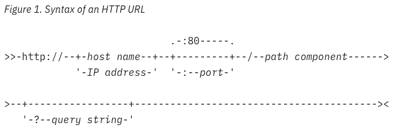
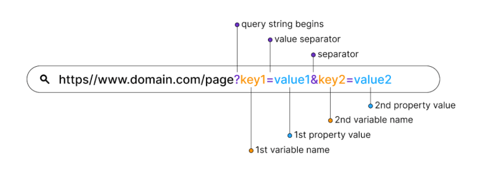
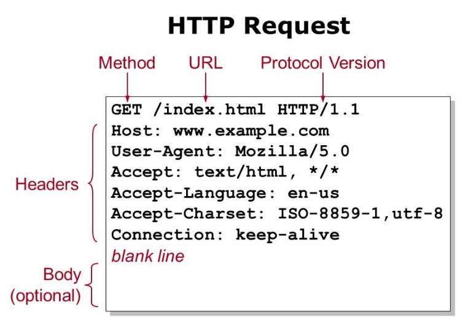
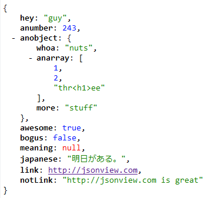
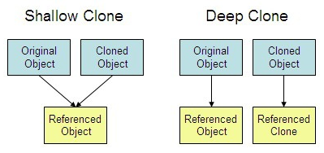
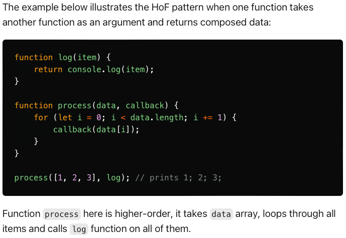
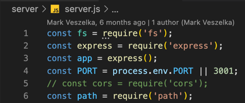
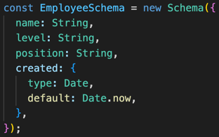

# Web Module Questions

### Functional patterns

#### What is a `callback function`?

A callback function is a `function passed into another function as an argument`, which is then invoked inside the outer
function to complete some kind of routine or action.

```js
function greeting(name) {
    alert(`Hello, ${name}`);
}

function processUserInput(callback) {
    const name = prompt("Please enter your name.");
    callback(name);
}

processUserInput(greeting);
```

#### What is `ECMA Script`? What is the difference between Javascript & ECMA Script?

JavaScript is a general-purpose scripting language that conforms to the ECMAScript specification.
The `ECMAScript specification is a blueprint for creating a scripting language`. JavaScript is an implementation of that
blueprint. On the whole, JavaScript implements the ECMAScript specification as described in ECMA-262. But there are some
key differences.

#### What is the difference between `let` & `var` ?

`Scoping rules`:\
The main difference in is scoping rules. Variables declared by `var` keyword are scoped to the immediate function body
(hence the `function scope`) while `let` variables are scoped to the immediate enclosing block denoted by `{ }`
(hence the `block scope`).

```js
function exampleVar() {
    if (true) {
        var variableVar = "I'm a var!";
    }
    console.log("Var Example: " + variableVar);
}

function exampleLet() {
    if (true) {
        let variableLet = "I'm a let!";
    }
// This will result in an error because variableLet is not accessible here
    console.log("Let Example: " + variableLet);
}

exampleVar(); // Outputs: Var Example: I'm a var!
exampleLet(); // Throws an error: ReferenceError: variableLet is not defined
```

`Hoisting`:\
While variables declared with `var` keyword are `hoisted` (`initialized with undefined` before the code is run) which
means they are accessible in their enclosing scope even before they are declared.

```js
// HOISTED:
var greeter; // declared and initialized with undefined, cause of hoisting
console.log(greeter); // Expected: 'undefined'
greeter = "hey hi";
```

`let` variables are `not initialized` until their definition is evaluated. Accessing them before the initialization
results in a `ReferenceError`. The variable is said to be in "temporal dead zone" from the start of the block until the
initialization is processed.

```js
// NOT HOISTED:
console.log(greeter); // Expected: 'Reference Error: Cannot access 'greeter' before initialization 
let greeter = "hey hi";

// SCOPING:
let greeter = "hey hi"; // global scope
if (true) {
    let greeter = "say Hello instead"; // function scope
    console.log(greeter); // Expected: 'say Hello instead'
}
console.log(greeter); // Expected: 'hey hi'

let greeter = "hey hi";
if (true) {
    let hello = "say Hello instead";
    console.log(hello); // Expected: 'say Hello instead'
}
console.log(hello); // Expected: 'Reference Error: hello is not defined'

// CONST:
const greeter = "hey hi";
greeter = "say Hello instead";
console.log(greeter); // Expected: 'TypeError: Assignment to constant variable'
```

#### Write an example where using the `var` declaration instead of the `let` could create a hard to debug code.

```js
function doSomething() {
    for (var i = 0; i < 3; i++) {
        setTimeout(function () {
            console.log(i);
        }, 1000);
    }
}

doSomething();
```

In this code, we have a function called `doSomething()` that uses a for loop to iterate over an array. Inside the loop,
we use `setTimeout` to print the value of the loop variable `i` to the console after a delay of one second.

If we use var to declare the loop variable 'i', `we will encounter a problem`: the value of 'i' inside the setTimeout
callback will be the same for all three iterations of the loop, and `it will be equal to 3` (the value of i when the
loop completes).

This is because `var has function scope`, so the variable 'i' is accessible throughout the entire function, not just
within the block scope of the for loop. When the setTimeout callbacks execute, they all reference the same 'i' variable,
which has been incremented to 3 by the end of the loop.

To fix this problem, we can use let instead of var, which will give us block scope for the loop variable 'i'.

#### Give a practical example where you would use the `reduce` function in JavaScript.

The `Array.prototype.reduce()` method executes a user-supplied "reducer" callback function on each element of the array,
in order,
passing in the return value from the calculation on the preceding element. The final result of running the reducer
across all elements of the array is a `single value`.

```js
// Calculate the sum of an array of numbers
const array1 = [1, 2, 3, 4];
// 0 + 1 + 2 + 3 + 4
const initialValue = 0;
const sumWithInitial = array1.reduce((accumulator, currentValue) => {
    return accumulator + currentValue;
}, initialValue);
console.log(sumWithInitial); // Expected output: 10
```

#### Give a practical example where you would use the `map` function in javascript.

The `Array.prototype.map()` method `creates a new array` populated with the results of calling a provided function on
every element in the calling array.

```js
const array = [1, 4, 9, 16];
// Pass a function to map
const map = array.map((x) => x * 2);
console.log(map); // Expected output: Array [2, 8, 18, 32]
```

#### Give a practical example where you would use the `filter` function in javascript.

The `Array.prototype.filter()` method `creates a shallow copy` of a portion of a given array, filtered down to just the
elements from the given array that pass the test implemented by the provided function.

```js
const words = ['spray', 'limit', 'elite', 'exuberant', 'destruction', 'present'];
const result = words.filter(word => word.length > 6);
console.log(result); // Expected output: Array ["exuberant", "destruction", "present"]
```

### Web basics

#### What is a `web server`?

On the `hardware side`, a web server is a computer that stores web server software and a website's component files (for
example, HTML documents, images, CSS stylesheets, and JavaScript files). A web server connects to the Internet and
supports physical data interchange with other devices connected to the web.

On the `software side`, a web server includes several parts that control how web users access hosted files. At a
minimum, this is an HTTP server. An HTTP server is software that understands URLs (web addresses) and HTTP (the protocol
your browser uses to view webpages). An HTTP server can be accessed through the domain names of the websites it stores,
and it delivers the content of these hosted websites to the end user's device.

`At the most basic level`, whenever a browser needs a file that is hosted on a web server, the browser requests the file
via HTTP. When the request reaches the correct (hardware) web server, the (software) HTTP server accepts the request,
finds the requested document, and sends it back to the browser, also through HTTP. (If the server doesn't find the
requested document, it returns a 404 response instead.)

#### Explain the `client-server architecture`.

The `client-server architecture` refers to a system that hosts, delivers, and manages most of the resources and services
that the client requests. In this model, all requests and services are delivered over a network, and it is also referred
to as the networking computing model or client-server network.

#### What is the difference between `synchronous` and `asynchronous` execution?

`Synchronous` execution means the first task in a program `must finish processing before moving on` to executing the
next task whereas \
`Asynchronous` execution means a second task can begin executing `in parallel`, without waiting for an earlier task to
finish.

#### What is `npm`? Why is it useful?

`NPM (Node Package Manager)` is a package manager for the Node JavaScript platform. It consists of a npm registry that
enables Open-Source developers to publish and share their code.
All `npm` packages are defined in files called `package.json`.
The content of `package.json must be written in JSON`. \
`npm` is installed with Node.js \
`npm` can manage dependencies. \
`npm` is the world's largest Software Registry. \
The registry contains over 800,000 code packages.

#### What is the difference between the `depdendencies` & `devDependencies` in a `package.json` file?

- `Dependencies`:
  Dependencies are libraries on which the project relies to function effectively.
  Production dependencies are fundamental dependencies that are required to complete the project.

- `Development Depenencies`:
  As a developer, you may want to install dependencies to build and test your website. The packages required by a
  developer during development are called `devDependencies`. Dependencies that you might need at some point in the
  development process, but not during execution. They are not included in the production version and will not be
  downloaded to end user’s browser caches. For example, `Nodemon`, lodash, Babel etc.

- `Package.json`:
  All `npm` packages are defined in files called package.json. The content of package.json must be written in JSON.
  `Package.json specifies these dependencies` under the key “dependencies”. These are the packages used in the project
  code.

#### What would be the impact of javascript `fetch` if it was not asynchronous?

- `Slowed performance`: Since the code would have to wait for the network request to complete before continuing, this
  would slow down the performance of the application, particularly if the request takes a long time to complete.

- `Poor user experience`: If the UI was blocked while the network request was being made, the user experience would be
  poor, as the user would have to wait for the request to complete before being able to interact with the application.

- `Limited concurrency`: Since JavaScript is a single-threaded language, blocking network requests would limit the
  concurrency of the application, making it difficult to handle multiple requests at once.

By `making the 'fetch' method asynchronous`, JavaScript allows the network request to be made in the background while
other code can continue to execute. This `keeps the UI responsive`and `allows multiple requests to be made
concurrently`, `improving the performance and user experience` of the application.

#### What benefits would bring to a developer to use the `Postman` application?

`Postman is an API Platform for developers to design, build, test and iterate their APIs.`

- `User-friendliness`: With a simple interface, testers can quickly create test suites by filling in templates.
- `Accessibility`: Postman users can access their files seamlessly by logging into their account on a device with the
  Postman application installed or Postman browser extension.
- `Various functionalities`: Postman supports all possible HTTP methods, saving progress, converting from APIs to code,
  changing the API development environment, and many others.
- `Request tracking capabilities`: For HTTP Response in Postman, it supports several status codes for users to verify
  the response. They are Successful requests, Empty response, Bad request, and Unauthorized access, to mention but a
  few.

#### List the `parts of the URL`.

A `URL (Uniform Resource Locator)` is a specific type of URI (Universal Resource Identifier). A URL normally locates an
existing resource on the Internet.

```html
scheme://host:port/path?query
```

> 

#### What is query parameter?

`Query parameters (query strings)` are a `defined set of parameters attached to the end of a url`. Query parameters are
elements inserted in your URLs to help you filter and organize content or track information on your website. They are
extensions of the URL that are used to help define specific content or actions based on the data being passed. To append
query params to the end of a URL, a `'?'` Is added followed immediately by a query parameter.


#### What kind of HTTP status codes do you know?

1. Informational responses (100 – 199): \
   `100 Continue`
2. Successful responses (200 – 299): \
   `200 OK`: The request succeeded.
3. Redirection messages (300 – 399): \
   `304 Not Modified`
4. Client error responses (400 – 499): \
   `400 Bad Request`: The server cannot or will not process the request due to something that is perceived to be a
   client error (e.g., malformed request syntax). \
   `404 Not Found`: The server cannot find the requested resource. In the browser, this means the URL is not recognized.
5. Server error responses (500 – 599): \
   `500 Internal Server Error`:
   The server has encountered a situation it does not know how to handle.

#### How does an HTTP Request look like? What are the most relevant HTTP header fields?

- `Request line`: This specifies the HTTP method (e.g. GET, POST, PUT, DELETE) and the URL being requested.
- `Headers`: These provide additional information about the request, such as the content type, cookies, and caching
  directives.
- `Body`: This contains any data being sent along with the request, such as form data or JSON payloads.



#### How does an HTTP Response look like? What are the most relevant HTTP header fields?

- `Status line`: This specifies the HTTP status code (e.g. 200 OK, 404 Not Found) and a brief message describing the
  status.
- `Headers`: These provide additional information about the response, such as the content type, cookies, and caching
  directives.
- `Body`: This contains the data being returned by the server, such as HTML, JSON, or an image

#### Why should you ignore the `node_modules` folder in `.gitignore`?

The node_modules folder contains all the saved JavaScript dependencies of a project. The `node_modules folder has a
massive size (up to Gigabytes)`.
It is easy to recreate the node_modules folder via packages.json. It is unnecessary to commit code that you didn't
write (in most cases).

### Rest API: Serve and Fetch

#### Why is it recommended for a developer to use the `HTTP methods` `get`, `put`, `delete`?

Using `HTTP methods` such as 'GET', 'PUT', and 'DELETE' is a recommended practice for web developers because they adhere
to the `principles of Representational State Transfer (REST)`, which is a widely-used architectural style for designing
networked applications.

- `GET`: This method is used to `retrieve information` or resources from a server. It is safe and idempotent, meaning it
  does not modify the state of the server and can be called multiple times with the same result.
- `PUT`: This method is used to `update or create` a resource on the server
- `DELETE`: This method is used to `delete` a resource on the server.

Using these HTTP methods in a `consistent and meaningful way` helps to create a well-designed and predictable API, which
can improve the maintainability, scalability, and reliability of web applications. It also adheres to the principles of
the HTTP protocol, which is the foundation of communication on the World Wide Web.

#### How does a `POST request` look like when it is made from a web browser (on the frontend written)?

```js
const createSomething = (something) => {
    return fetch(`/api/something/${something._id}`, {
        method: "POST",
        headers: {
            "Content-Type": "application/json",
        },
        body: JSON.stringify(something),
    }).then((res) => res.json());
};
```

#### What is an `API`?

`API` stands for `Application Programming Interface`. APIs are mechanisms that `enable two software components to
communicate with each other using a set of definitions and protocols`. For example, the weather bureau’s software
system contains daily weather data. The weather app on your phone 'talks' to this system via APIs and shows you daily
weather updates on your phone. An API is a Collection of HTTP endpoints on the server side.

- `Data Retrieval`: APIs allow developers to request and retrieve specific data or information from a service or
  application. For example, a weather API can provide real-time weather data when queried with location information.
- `Functionality Integration`: APIs enable developers to integrate functionalities or services provided by other
  applications into their own software. This allows them to leverage existing tools and services without having to build
  everything from scratch.
- `Application Development`: APIs often provide libraries, frameworks, or SDKs (Software Development Kits) that simplify
  the development process by offering pre-built functions and components. These tools provide a consistent interface and
  functionality, making it easier for developers to create new applications.
- `Service Interaction`: APIs facilitate communication and interaction between different services or systems.
- For example, an API may be used to send notifications, process payments, or connect to social media platforms.

#### What is `REST API`?

`REST API` stands for `Representational State Transfer Application Programming Interface`. It is a set of constraints
and principles for designing networked applications. REST is an architectural style that defines a set of constraints
to be used when creating web services. A RESTful API is an API that adheres to these constraints and principles.

`REST is based on a client-server architecture`, where the `client` (such as a web browser or a mobile
app) `interacts with a server` (a web service or a backend application) to request and manipulate resources. Resources
are identified by `URIs (Uniform Resource Identifiers)`, and clients can perform operations on these resources using
standard `HTTP methods, such as 'GET', 'POST', 'PUT', 'DELETE'`, etc.


#### What is `JSON` and how do we use it?

`JSON (JavaScript Object Notation)` is used for representing structured data in a `simple and portable format`. It
`consists of key-value pairs`, where `keys` are strings and `values` can be strings, numbers, boolean values, arrays,
or nested JSON objects. JSON data is represented using a syntax that is similar to JavaScript object literal notation,
which makes it easy to understand and manipulate by both humans and machines.
To use JSON in a web application, you can use JavaScript to parse JSON strings into JavaScript objects, and vice versa.
In JavaScript, you can use the JSON object, which provides methods like `'JSON.parse()'` to parse JSON strings into
JavaScript objects, and `'JSON.stringify()'` to convert JavaScript objects into JSON strings. Similarly, in other
programming languages, there are libraries or built-in functions available to parse and generate JSON data.



#### What is `API versioning` ?

API versioning allows for changes and updates to be made to an API while minimizing the impact on existing client
applications. It helps maintain backward compatibility and smooth evolution of APIs over time, allowing developers to
make improvements and fix issues without disrupting existing API consumers.

#### Give `3 examples of HTTP response status codes` ? Explain what each number means.

`200 OK`: This status code indicates a `successful HTTP request`. It means that the server has successfully processed
the request, and the requested data is included in the response body. This status code is commonly used for successful
GET, PUT, and DELETE requests.

`404 Not Found`: This status code indicates that the requested `resource could not be found on the server`. It means
that the server was unable to locate the resource specified in the URL provided in the request. This status code is
commonly used when a client requests a resource that does not exist or has been removed from the server.

`500 Internal Server Error`: This status code indicates that
the `server encountered an unexpected error while processing the request`. It means that there was an issue on the
server side that prevented the request from being fulfilled. This status code is commonly used when there is a
server-side error, such as a bug in the application code or an issue with the server configuration.

### Advanced JavaScript

#### How does the `ternary operator` looks like in javascript?

The ternary operator is a `shorthand way of writing an 'if-else'` statement in JavaScript. It has the following syntax:

```js
(condition) ? valueIfTrue : valueIfFalse

function getFee(isMember) {
    return isMember ? '$2.00' : '$10.00';
}

console.log(getFee(true));
// Expected output: "$2.00"

console.log(getFee(false));
// Expected output: "$10.00"

console.log(getFee(null));
// Expected output: "$10.00"
```

#### How to `import a function from another module` in JavaScript?

In JavaScript, you can use the 'import' statement to import a function or other entities (such as objects, classes, or
variables) from another module. Here's the basic syntax for importing a function from another module:

```js
import {functionName} from './modulePath';
```

#### What is a `shallow copy` on an object?

In JavaScript, a `shallow copy` of an object refers to a new object that is `created by copying the references of the
original object's properties to the new object, without actually creating new copies of the property values themselves`.
In other words, `the new object shares the same references to the properties as the original object`, but any changes
made to the property values in the new object will not affect the original object, and vice versa.



```js
// SHALLOW COPY With Array.from()
Array.from();
const ingredientsList = ["noodles", {list: ["eggs", "flour", "water"]}];

const ingredientsListCopy = Array.from(ingredientsList);
console.log(ingredientsListCopy);
// ["noodles",{"list":["eggs","flour","water"]}]

// DEEP COPY With structureClone()
// Create an object with a value and a circular reference to itself.
const original = {name: "MDN"};
original.itself = original;

// Clone it
const clone = structuredClone(original);

console.assert(clone !== original); // the objects are not the same (not same identity)
console.assert(clone.name === "MDN"); // they do have the same values
console.assert(clone.itself === clone); // and the circular reference is preserved
```

#### What is a `callback function`? Tell some examples of its usage.

Higher-Order Functions(HoF) and Callback Functions(CB) are different.\
`Higher-Order Functions(HoF)`: A function that takes another function(s) as an argument(s) and/or returns a function as
a value.\



`Callback Functions(CB)`: A function that is passed to another function.

- `Asynchronous operations:` Callback functions are commonly used in asynchronous programming, where operations are
  non-blocking and do not halt the execution of the program. For example, in JavaScript, callback functions can be used
  with functions like `setTimeout` and `fetch` to execute code after a certain period of time or when data is retrieved
  from a server, respectively. The callback function is called when the operation is complete, allowing the program to
  continue executing other tasks in the meantime.

```js
  setTimeout(function () {
    console.log("This is a callback function called after 1 second.");
}, 1000);
  ```

- `Event handling:` Callback functions are often used to handle events in event-driven programming. For example, in web
  development, JavaScript uses `EventListeners` that are callback functions to respond to user interactions such as
  button clicks, mouse movements, and keyboard events.

```js
  document.getElementById("myButton").addEventListener("click", function () {
    console.log("Button clicked!");
});
```

- `Error handling:` Callback functions can be used to handle errors or exceptions in asynchronous operations or other
  scenarios. For example, in Node.js, callback functions are often used in error-first callbacks, where the first
  argument to the callback is reserved for an error object, allowing error handling in asynchronous operations.

```js
  fs.readFile('file.txt', 'utf8', function (err, data) {
    if (err) {
        console.error('Error reading file:', err);
    } else {
        console.log('File contents:', data);
    }
});
```

#### What is `object destructuring` in javascript?

`Object destructuring` is a feature in JavaScript that allows you to `extract properties from an object and assign them
to individual variables` in a concise and convenient way. It provides a shorter syntax for extracting values from
objects
and avoids repetitive object property access.
Here's an example of object destructuring in JavaScript:

```js
const person = {
    firstName: 'John',
    lastName: 'Doe',
    age: 30,
    city: 'New York'
};

// Extracting properties using object destructuring
const {firstName, lastName, age, city} = person;

console.log(firstName); // Output: 'John'
console.log(lastName); // Output: 'Doe'
console.log(age); // Output: 30
console.log(city); // Output: 'New York'
```

#### What is `array destructuring` in javascript?

`Array destructuring` is a feature in JavaScript that allows you to `extract elements from an array and assign them to
individual variables` in a concise and convenient way. It provides a shorter syntax for extracting values from arrays
and
avoids repetitive array element access.
Here's an example of array destructuring in JavaScript:

```js
const numbers = [1, 2, 3, 4, 5];

// Extracting elements using array destructuring
const [a, b, c, d, e] = numbers;

console.log(a); // Output: 1
console.log(b); // Output: 2
console.log(c); // Output: 3
console.log(d); // Output: 4
console.log(e); // Output: 5
```

#### What is the `(...)spread operator` in `js` ?

The `spread operator` in JavaScript `('...')` is a syntax that allows you to "spread" elements of an iterable (e.g., an
array, string, or object) into another iterable or as arguments to a function or method. It provides a concise way to
expand an iterable into individual elements and use them in various contexts.

- `Array spreading`: You can use the spread operator to create a new array by spreading the elements of an existing
  array into a new array.
- `Function arguments`: You can use the spread operator to pass the elements of an array as individual arguments to a
  function.
- `Object spreading`: You can use the spread operator to create a new object by spreading the properties of an existing
  object into a new object.
-

```js
function sum(x, y, z) {
    return x + y + z;
}

const numbers = [1, 2, 3];

console.log(sum(...numbers));
// Expected output: 6

console.log(sum.apply(null, numbers));
// Expected output: 6
```

#### What are the differences between the `arrow` function and the regular `function`?

Arrow function is an anonymous function, which is an alternative to traditional function expression, used for
single-use case.

```js
// Traditional anonymous function
(function (a) {
    return a + 100;
});

// 1. Remove the word "function" and place arrow between the argument and opening body brace
(a) => {
    return a + 100;
};

// 2. Remove the body braces and word "return" — the return is implied.
(a) => a + 100;

// 3. Remove the parameter parentheses
a => a + 100;
```

#### What is the `import` keyword used for?

With the `'import'` statement, you can load functions, classes, objects, or other code from external modules into your
current module, allowing you to organize and modularize your codebase. The 'import' statement is used in conjunction
with the 'export' statement, which is used to define what functionality is exposed from a module and can be imported by
other modules.

```js
import defaultExport from "module-name";
import * as name from "module-name";
import {export1} from "module-name";
import {export1 as alias1} from "module-name";
import {default as alias} from "module-name";
import {export1, export2} from "module-name";
import {export1, export2 as alias2, /* … */} from "module-name";
import {

"string name"
as
alias
}
from
"module-name";
import defaultExport, {export1, /* … */} from "module-name";
import defaultExport, * as name from "module-name";
import "module-name";
```

#### What is the `required` used for?

The '`require()`' function is typically `used to load Node.js built-in modules`, third-party libraries, or custom
modules defined by the developer. When a module is required using the 'require' statement, its code is executed, and the
exported functionality is returned to the importing module, allowing you to use the exported functions, objects, or
other code in your current module.



#### What are `template literals`?

`Template literals`, also known as template strings, are a feature in JavaScript that allow for more flexible and
readable string formatting compared to traditional string concatenation methods. Template literals are enclosed in
backticks `(` `)` instead of single or double quotes used in regular strings.
Template literals support embedding expressions inside the string using placeholders, denoted by `${ }`. These
expressions can be variables, expressions, or even complex JavaScript code, which are evaluated and interpolated into
the resulting string at runtime.

```js
`string text`

    `string text line 1
string text line 2`

    `string text ${expression} string text`

tagFunction`string text ${expression} string text`
```

### React basics

#### What benefits does it bring for a developer to use `components` (opposed of writing all the code in a single file)?

Using components, as opposed to writing all the code in a single file, brings several benefits for developers:

- `Modularity`: Components allow for the modular organization of code, breaking down a complex application into smaller,
  manageable parts. This promotes code `reusability, maintainability, and scalability`. Components can be reused across
  different parts of the application or even across different applications, saving time and effort in development.

- `Separation of Concerns`: Components promote separation of concerns by encapsulating the logic, presentation, and
  state of a specific part of an application into a single unit. This makes it easier to understand, manage, and update
  code related to a specific feature or functionality.

- `Readability and Maintainability`: Components make code more readable and maintainable by providing a clear structure
  and organization. Each component typically has a specific responsibility, making it easier to understand and
  troubleshoot issues. Changes or updates to a component can be made without affecting other parts of the application,
  reducing the risk of introducing bugs or unintended side effects.

- `Code Reusability`: Components can be reused in different parts of an application or even in different applications,
  saving time and effort in development. This promotes code reusability, reducing duplication and ensuring consistency
  across the application.

- `Collaboration and Teamwork`: Components facilitate collaboration and teamwork among developers by providing a clear
  separation of concerns and a common language for discussing and sharing code. Components can be developed
  independently by different team members, and changes to a component can be easily tracked and merged in version
  control systems.

- `Testing`: Components can be easily tested in isolation, making it easier to write unit tests and integration tests
  for specific parts of an application. This helps in identifying and fixing issues early in the development process,
  leading to higher code quality and reliability.

#### What is the difference between `Element and Component`?

The main difference between an element and a component is the level of abstraction and encapsulation. An `element` is a
basic building block that defines the structure and content of a web page, while a `component` is a higher-level
abstraction that encapsulates the behavior and appearance of a specific part of an application. Components are typically
designed to be reusable, modular, and self-contained, with their own logic, state, and presentation, whereas elements
are the basic HTML tags that make up the structure of a web page.

```js
// ELEMENT:
import React from 'react';
import React from 'react';
import ReactDOM from 'react-dom';
// Without JSX
const ele1 = React.createElement(
    'h1',
    {id: 'header'},
    'Hey Geek'
);
ReactDOM.render(ele1, document.getElementById('root'));

// COMPONENT:
import React from 'react';
import ReactDOM from 'react-dom';

function Welcome(user) {
    return <div>
        <h3>Welcome {user.name}</h3>
    </div>
}

const ele = <Welcome name="Geek"/>
ReactDOM.render(ele, document.getElementById("root"));
```

#### How do you pass values between components in `React`?

In React, there are several ways to pass values (data) between components. Some of the common methods include:

- `Props (Properties)`: Props are used to pass data from a parent component to a child component. The parent component
  can pass data as props when rendering the child component, and the child component can access the passed data through
  its props object. Props are read-only, meaning that the child component cannot modify the values of props directly.

```js
function Welcome(props) {
    return <h1>Hello, {props.name}</h1>;
}
```

- `State Lifting`: If the components that need to share data are not directly parent and child components in the
  component tree, you can use a technique called `state lifting`. This involves lifting the state (data) to a common
  ancestor component and passing it down as props to the child components that need it.

- `Context API`: The Context API in React allows you to share data between components without having to pass it
  explicitly as props through every level of the component tree. Context provides a way to share data globally within an
  application, and components can access the shared data using the 'useContext' hook or the 'Context.Consumer'
  component.

- `Redux or other state management libraries`: Redux is a popular state management library for React (though there are
  others as well). It allows you to manage application state in a centralized store, and components can access and
  update the store data through actions and reducers. This can be used to share data between components that are not
  directly connected in the component tree.

- `Event handling and callbacks`: Components can communicate with each other by passing callback functions as props,
  which can be called by child components to notify the parent component of changes or events. This can be used to pass
  data between components based on user interactions, such as form submissions, button clicks, etc.

#### What is `key` prop?

In React, the `'key' prop` is a special attribute that is used to `uniquely identify` child elements in a list rendered
by a component. It is required when rendering an array of components or elements using the `map()` function or other
iteration methods. Each item in the list must have a unique 'key' prop to help React efficiently update the UI when the
list changes.

The 'key' prop serves as a hint to React to identify the corresponding DOM element for each item in the list. When the
list is updated, React uses the 'key' prop to determine which items are added, removed, or reordered. By providing a
unique 'key' for each item, React can optimize the DOM updates and avoid unnecessary re-rendering of components,
resulting in better performance.

#### How does a child component `pass data` to its parent component ?

In React, data can be passed from child component to parent component `through the use of callback functions`.

The parent component can pass a function down to the child component as a prop. The child component can then call this
function with the data it wants to pass to the parent component. The parent component will receive the data as an
argument in the function and can then use it as needed.

#### Write the code to create in `JSX` an HTML DIV element that has the innerText the contents of the variable

`let name = 'Andrew'`

```jsx
let name = 'Andrew';
<div>{name}</div>
```

#### Write the code to create in `JSX` an unordered list from the array `let names = ["Mathew", "John", "Maverik"]`

```jsx
let names = ["Mathew", "John", "Maverik"];
<ul>
    {names.map((name) => (
        <li key={name}>{name}</li>
    ))}
</ul>
```

#### Write the code to set the background color red of a div in JSX.

```jsx
<div style={{backgroundColor: "red"}}>
    // Your content here
</div>
```

### React patterns

#### What is the difference between `Real DOM and Virtual DOM`?

`Real DOM (Document Object Model)` is the actual structure of the web page or application that is created in the memory
of the browser. When changes are made to the content of a web page or application, the Real DOM has to update its
structure, and this can be a time-consuming process, especially for complex applications.

`Virtual DOM`, on the other hand, is a lightweight copy of the Real DOM that can be updated much faster. It is a
representation of the structure of the web page or application in memory, and it can be updated and manipulated more
quickly than the Real DOM. React is an example of a library that uses Virtual DOM to update the UI efficiently.


#### When adding an item to an array, why is it necessary to pass a new array to the `useState` hook ?

When adding an item to an array using the `useState` hook in React, it is necessary to pass a new array to the hook
because the state in React is immutable, which means that it cannot be directly modified. Instead, we need to create a
new state object that includes any changes we want to make.

If we attempt to modify the existing state array directly, React will not be able to detect the change, and the
component will not re-render. This is because React only re-renders when the state changes, and it uses a process
called "reconciliation" to compare the previous state and the new state to determine what has changed. By passing a new
array to the useState hook, we ensure that React recognizes the state change and triggers a re-render of the component.

#### Describe what techniques or tools you use to `debug a React app`.

- `Console.log()`: This is a basic debugging technique that involves using console.log() to output values to the console
  to verify if they are what you expect. You can add console.log() statements to your code to help you identify where a
  problem is occurring.

- `React Developer Tools`: This is a browser extension that allows you to inspect the React component tree, view props
  and state, and see how they are changing over time. It is an essential tool for debugging React apps.

- `Chrome DevTools`: This is a browser-based tool that can be used to inspect and debug your React app. It allows you to
  view and modify the DOM, inspect network activity, and set breakpoints in your code to pause the execution of the app
  and examine its state.

- `React error boundaries`: These are components that you can wrap around parts of your app to catch and handle errors
  that would otherwise crash your app. By wrapping components in error boundaries, you can prevent the app from crashing
  and provide a more graceful way of handling errors.

- `Code editors`: Many code editors come with built-in debugging tools that allow you to step through your code line by
  line, set breakpoints, and examine variables and their values.

- `Third-party libraries`: There are many third-party debugging tools and libraries available for React that can help
  you identify and resolve issues in your app. Some popular examples include Sentry, Bugsnag, and LogRocket. These tools
  can provide detailed insights into app crashes and help you identify and fix problems more quickly.

#### What is the difference between a React `class` component & a `functional` component ?

`Class components` are created using JavaScript classes that extend the React.Component class. They are used to create
more complex components that can have their own state and lifecycle methods. They have a render method which returns the
JSX that should be rendered to the DOM.

`Functional components` are simpler and more lightweight. They are just JavaScript functions that return JSX. They are
used for simpler components that don't require state or lifecycle methods. They are easier to test and understand than
class components.

In general, functional components are preferred over class components because they are simpler, faster and easier to
test. However, class components may still be necessary for certain use cases, such as when you need to maintain a state
or implement lifecycle methods.

#### Name 3 lifecycle states in a React `functional` component.

`useEffect`: This hook is used to perform side effects in response to component updates.\

`useState`: This hook is used to manage state in functional components.\

`useContext`: This hook is used to access context in functional components.

#### What is conditional rendering in `React` ? Give an example.

`Conditional rendering` is the process of displaying different parts of a React component based on certain conditions.
It means that the component will render different parts of the UI depending on the state of the application.

#### Write the code that prints to the console `component destroyed` when the component it is part of is removed from the DOM tree.

```js
class MyComponent extends React.Component {
    componentWillUnmount() {
        console.log("component destroyed");
    }

    render() {
        return <div>Hello World!</div>;
    }
}
```

#### Why is there an `infinite loop` in this code

```js
function App() {
    const [count, setCount] = useState(0); //initial value of this 
    useEffect(() => {
        setCount((count) => count + 1); //increment this Hook
    }); //no dependency array.
    return (
        <div className="App">
            <p>value of count: {count} </p>
        </div>
    );
}
```

There is an infinite loop in the code because the useEffect hook is executed on every render of the component, and it
updates the count state value by incrementing it by 1. Since there is `no dependency array` provided to useEffect, it
runs after every render, causing the state update to trigger a re-render, which triggers the useEffect again, leading to
an infinite loop. To fix this, a dependency array should be provided to useEffect so that it only runs when the
specified dependencies change.

#### Why is there an `infinite loop` in this code

```jsx
  async function App() {
    const [count, setCount] = useState("");
    setCount(count + 1);
    return (
        <div className="App">
            <p>value of count: {count} </p>
        </div>
    );
}
```

There is an infinite loop in this code because setCount(count + 1) is called during the initial render of the component,
which updates the state count and triggers a re-render of the component. Since setCount is called inside the functional
component body without any condition or dependency array, it will trigger a re-render on every render cycle, leading to
an infinite loop.

Also, the initial value of count is set as an empty string, and adding a number to an empty string results in
concatenation instead of addition. Therefore, count + 1 will result in "1" instead of the expected 1.

### Mongo & mongoose

#### What is a `database schema` ?

A `database schema is a structure that defines the organization, format, and constraints of data stored in a database`.
It specifies the tables, fields, relationships, and rules that govern how data is stored and accessed.



#### Why is the `id` unique in a database ?

The id field is typically unique in a database to ensure that each record or document `can be uniquely identified`.
Uniqueness helps maintain data integrity and enables efficient retrieval, updates, and deletion of specific records.

#### What are the advantages & disadvantages of using `lean()` function in a mongo query ?

In Mongoose, the `lean()` function is a method that can be applied to a query to retrieve plain JavaScript objects
instead of fully-fledged Mongoose documents. By using lean(), the query execution is optimized, resulting in faster
performance and reduced memory consumption.
Advantage:

- `Improved Performance`: The lean() function retrieves plain JavaScript objects instead of mongoose documents,
  resulting in faster query execution and reduced memory usage.
- `Reduced Overhead`: By avoiding the additional functionality and methods provided by mongoose documents, the lean()
  function reduces the overhead of unnecessary processing and memory allocation.
- `Less Memory Consumption`: Plain JavaScript objects consume less memory compared to full mongoose documents, making it
  more efficient when dealing with large datasets.
  Disadvantage:
- `Limited Functionality`: The returned plain objects lack the additional functionality and methods provided by mongoose
  documents, such as built-in validation and middleware hooks.
- `Missing Mongoose Features`: Some mongoose features, such as virtuals, getters, and setters, are not available when
  using lean().
- `No Automatic Caching`: Mongoose documents have built-in caching mechanisms that can improve performance. By using
  lean(), you lose the benefits of automatic caching, requiring manual implementation if needed.
- `Inability to Use Mongoose Methods`: Certain mongoose methods like save() and populate() do not work with plain
  objects retrieved using lean().

#### Write the code to store the object `{name: "Andrew", age: 10}` to a mongo database. You can ignore the part of connection parameters.

```js
await PersonModel.create({name: "Andrew", age: 10});
```

#### Write the code to delete from a mongo database all employees that are over 18 years. The scheme for an employee is `{name: string, age: int}`. You can ignore the part of connection parameters.

```js
await EmployeeModel.deleteMany({age: {$gt: 18}});
```

#### Write the code to display in the console from a mongo database the employees who are over 18 years. The scheme for an employee is `{name: string, age: int}`. You can ignore the part of connection parameters.

```js
  try {
    const employees = await EmployeeModel.find({age: {$gt: 18}});
    console.log(employees);
    return res.json(employees);
} catch (error) {
    return next(error);
}
```

#### Write the code to update from a mongo database the employees with name='John' and set the new age to 8. The scheme for an employee is `{name: string, age: int}`. You can ignore the part of connection parameters.

```js
const employees = await EmployeeModel.updateMany(
    {name: 'John'}, // filter
    {age: 8}, // update
    {new: true});
```

### Mern stack

#### What does `MERN` stand for in the context of web development ?

`MERN` stands for a collection of technologies:

`MongoDB`: A NoSQL database that `stores data` in JSON-like documents.\
`Express`: A web framework for Node.js that provides a set of tools for `building web applications and APIs`.\
`React`: A JavaScript library for `building user interfaces`.\
`Node.js`: A JavaScript runtime that `allows running JavaScript code` on the server-side.
Together, these technologies make up a popular tech stack for building modern web applications.

#### What is routing in the context of a `React` app ?

`In the context of a react app`, routing refers to the process of defining
and `managing navigation within the application`. It allows for the creation of different paths or URLs that correspond
to specific components or pages in the application. By using routing, users can easily navigate to different parts of
the application without having to manually manipulate the URL or reload the page.

In react, there are several libraries that can be used for routing, such as react-router-dom and reach-router. These
libraries provide components and APIs that allow for the definition of different routes, as well as for passing data and
parameters between different components. Routing is an important concept in building larger react applications as it
helps to organize the structure of the application and provide a more seamless user experience.

#### What is routing in the context of an `express` app ?

`Routing in the context of an Express app` refers to the process of defining routes to handle incoming HTTP requests.
Routes are defined using the app.METHOD(PATH, HANDLER) functions, where METHOD is an HTTP request method such as GET,
POST, PUT, DELETE, etc., PATH is the URL path, and HANDLER is the function that will be executed when a request is made
to that path.

Routing in Express allows developers to create flexible and dynamic applications by handling different requests and
returning different responses based on the requested URL, HTTP method, request parameters, query parameters, and request
body.

#### What is `CORS` policy ?

`CORS (Cross-Origin Resource Sharing)` is a security feature implemented in web browsers that restricts web pages from
making requests to a different domain than the one that served the web page. The purpose of this policy is to prevent
malicious websites from accessing or modifying sensitive data on other websites without permission.

#### What advantages does a developer have for using `bootstrap` or `material ui` ?

- `Consistent and professional design:` Both Bootstrap and Material UI provide a set of pre-designed UI components and
  elements, which makes it easier for developers to create consistent and professional-looking UIs across the entire
  application.

- `Responsiveness:` Bootstrap and Material UI are designed with a mobile-first approach, meaning they are optimized for
  small screens and touch-based input. This makes it easier for developers to create responsive applications that work
  well on any device.

- `Cross-browser compatibility:` Both Bootstrap and Material UI are designed to work seamlessly across different web
  browsers, so developers don't have to spend extra time testing and debugging for different browsers.

- `Easy to customize:` Both Bootstrap and Material UI come with a variety of customization options, such as color
  schemes, typography, and components, which allows developers to create unique designs that align with their brand and
  requirements.

- `Community support:` Both Bootstrap and Material UI have large and active communities of developers, which means there
  are plenty of resources and documentation available for developers to learn and troubleshoot any issues they
  encounter.

