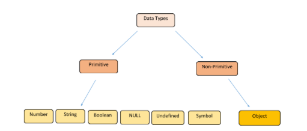

# Programming Basics questions

## Data basics

#### What are the differences `between objects and arrays`? What is the purpose of the object and what is the purpose of the array?

`Arrays` are ordered collection of values, they store a list of values, whereas `objects` store key - value pairs. They
are both special data types and also they are both mutable.

```js
// ARRAY:
// Creating an array of numbers
const numbers = [1, 2, 3, 4, 5];
// Accessing elements in an array
console.log(numbers[0]); // 1
console.log(numbers[2]); // 3
// Iterating through an array
numbers.forEach((number) => {
    console.log(number);
});
// Modifying an array
numbers.push(6); // Adds 6 to the end of the array
numbers.pop(); // Removes the last element (5)
// Finding the length of an array
console.log(numbers.length); // 5
```

```js
// OBJECT:
// Creating an object to represent a person
const person = {
    name: "John Doe",
    age: 30,
    address: "123 Main St",
};
// Accessing properties in an object
console.log(person.name); // "John Doe"
console.log(person.age); // 30
// Adding new properties to an object
person.email = "john@example.com";
// Iterating through an object's properties
for (const key in person) {
    console.log(key, person[key]);
}
// Modifying an object's properties
person.age = 31;
// Deleting a property from an object
delete person.address;
// Checking if a property exists in an object
console.log("email" in person); // true
console.log("address" in person); // false
```

#### How can you access a `key's value` in an object?

You can use the `.(dot)` or `bracket [] notation`. So `cars.volvo` or `cars[volvo]`.

```js
const person = {
    name: "John",
    age: 30,
};
// Accessing values using dot notation
const name = person.name;
const age = person.age;
console.log(name); // "John"
console.log(age); // 30
```

```js
const person = {
    "full name": "John Doe",
    "address 1": "123 Main St",
};
// Accessing values using square bracket notation
const fullName = person["full name"];
const address = person["address 1"];
console.log(fullName); // "John Doe"
console.log(address); // "123 Main St"
```

#### How can you access the `first and the last item` of an array?

```js
const myArray = [1, 2, 3, 4, 5];

// Accessing the first item
const firstItem = myArray[0];
console.log(firstItem); // 1

// Accessing the last item
const lastItem = myArray[myArray.length - 1];
console.log(lastItem); // 5
```

#### Name all the `primitive types` in JavaScript.

In JavaScript, a `primitive` (primitive value, primitive data type) is data that is not an object and has no methods or
properties. All primitives are immutable. Primitive types copied by value, reference types by reference (memory
address). There are 7 primitive data types:

String / Number / Bigint / Boolean / Undefined / Symbol / Null



## Algorithm basics

#### What are the `assignment operators`? Name some of them.

Assignment operators in JavaScript are used to assign values to variables. They perform the assignment while also
allowing for various operations to be combined with the assignment.

| = | += | -= | *= | /= | %= | **=

```js
let x = 10; // Assigns the value 10 to variable x
let y = 5;
y += 3; // Equivalent to y = y + 3
let z = 10;
z -= 4; // Equivalent to z = z - 4
```

#### What are the `arithmetic operators`? Name some of them.

Arithmetic operators in JavaScript are used to perform various mathematical calculations on numerical values.

| + | - | * | / | ++ (increment)| -- (decrement)| % | - (unary negation) | + (unary plus)

#### What are the `comparison operators`? Name some of them.

Comparison operators in JavaScript are used to compare values and return a Boolean result indicating whether the
comparison is true or false.

| < | > | >= | <= | === | !==

#### What are the `logical operators`? Name some of them.

&& and\
|| or\
! not

#### What is the difference between `for`, `for of` and `for in`?

They can all be used to loop through values in an array.\
`For` loops through a block of code a number of times\
`For of` loops through values of an iterable object\
`For in` loops through the keys of an object

#### How do you find the `average of values` in an array if you can’t use any built-in functions or methods?

A: I add the values using a loop and divide the result by the length of the array.

## Function basics

#### What are the main `parts of a function`?

The `function` keyword\
`Name` (if not anonymous)\
A list of `parameters in ()`\
A `statement in {}`\
The `calling` part of the function

```js
function name(parameter1, parameter2, parameter3) {
    // code to be executed
}

name(argument1, argument2, argument3);
```

#### What is the difference between `parameters` and `arguments`?

Parameters are listed in the definition of a function whereas arguments are the actual values given to the function for
it to make transformation on.

#### What are the differences between `function statement (declaration)` (function foo() {}) and `function expression`(let foo = function () {})?

`Function statement` is the definition of a function. It loads before any code is executed (hoisting). Function
keyword (so functions) are hoisting!
You CAN call before it is defined.

```js
// Function statement
function sum(a, b) {
    return a + b;
}

// You can call the function before its declaration
var result = sum(5, 3);
console.log(result); // Output: 8
```

A `function expression` associates a value with a variable, just like any other assignment statement. Function
expressions load only when the interpreter reaches the definition of the function. Because `let` and `const` are not
hoisting!
You MUST define before calling.

```js
// Function expression
var product = function (x, y) {
    return x * y;
};

// You must call the function after its declaration
var result = product(4, 7);
console.log(result); // Output: 28
```

## OOP Basics

#### What is a `method`?

A method in JavaScript is a function that is `associated with an object`. It is used to perform a specific action on the
object it is called upon.

```js
// Object definition
var person = {
    firstName: "John",
    lastName: "Doe",
    fullName: function () {
        return this.firstName + " " + this.lastName;
    }
};
// Accessing a property
console.log(person.firstName); // Output: John
// Calling a method
console.log(person.fullName()); // Output: John Doe
```

#### Name `3 built-in functions` (and/or methods) regarding `strings`.

1. String.prototype.replace(), .replaceAll();
2. .toUpperCase() / .toLowerCase();
3. .split();

#### Name `3 built-in functions` (and/or methods) regarding `arrays`.

1. Array.prototype.join();
2. .concat();
3. .push();

#### Name `3 built-in functions` (and/or methods) regarding `numbers`.

1. .toString();
2. Number();
3. Date();

## FP Basics

#### What is a `callback function`?

A callback function in JavaScript is a function that is passed as an argument to another function and is executed after
some kind of event, such as a click or an API response, has taken place. Callbacks allow for asynchronous programming,
allowing the main execution of code to continue while the callback function is executed at a later time.

```js
function myFirst() {
    myDisplayer("Hello");
}

function mySecond() {
    myDisplayer("Goodbye");
}

myFirst();
mySecond();
```

#### What are the differences between `for` loops and `forEach`?

```js
// FOR LOOP:
const array = [1, 2, 3, 4, 5];

for (let i = 0; i < array.length; i++) {
    console.log(array[i]);
}
```

```js
// FOR EACH METHOD (HOF):
const array = [1, 2, 3, 4, 5];

array.forEach(function (element) {
    console.log(element);
});
```

`Syntax`:\
`for loops`: have a more complex syntax, which allows for more control over the iteration, including the use of
a counter and the ability to exit (to `break`) the loop early.\
`forEach`: (methods) loops have a simpler syntax and do
not have a counter or the ability to exit early.

`Scope`:\
`for loops`: have their own block scope, which means variables declared inside the loop are only accessible
within the loop.\
`forEach`: loops do not have their own block scope and variables declared inside the loop are accessible
outside the loop.

`return statement`: The return statement inside a forEach loop only breaks out of the current iteration, not the entire
loop. In contrast, the return statement inside a for loop will exit the entire loop.

Modifying the array: forEach loops cannot modify the original array during iteration, while for loops can modify the
original array.

In summary, for loops are better suited for situations that require more control over the iteration, while forEach loops
are simpler and better suited for basic iteration tasks.

## File basics

#### What is the difference between `JavaScript` data structures and `JSON` data structures?

`Syntax`: JSON data structures use strict syntax rules and only support a limited set of data
types (`strings, numbers, objects, arrays, booleans, and null`), while JavaScript data structures have a more flexible
syntax and support a wider range of data types, including `functions and dates`.

`Purpose`: JSON data structures are primarily used `for data interchange between systems`, while JavaScript data
structures are used `for data storage and manipulation` within a JavaScript application.

`Serialization/Deserialization`: JSON data structures can be easily serialized (converted to a string representation)
and deserialized (converted back to a JavaScript object) using the `JSON.stringify()` and `JSON.parse()` methods,
respectively. JavaScript data structures can also be serialized and deserialized, but this process is more complex and
requires custom code.

`Representation`: JSON data structures can only represent a single, simple data structure (such as an object or array),
while JavaScript data structures can represent complex data structures, including nested objects and arrays, and linked
data structures such as linked lists and trees.

In conclusion, JSON data structures are best suited for data interchange between systems, while JavaScript data
structures are better suited for data storage and manipulation within a JavaScript application.

#### How do you create JavaScript data structure from a JSON file's data?

```js
const fs = require('fs');
const data = fs.readFileSync('/Users/joe/test.txt', 'utf8');
// Step 1: Read the JSON file
fs.readFile('test.txt', 'utf8', (err, data) => {
    if (err) {
        console.error(err);
        return;
    }
    // Step 2: Parse JSON data
    try {
        const jsonData = JSON.parse(data);
        // Step 3: Use the data to create JavaScript data structures
        const name = jsonData.name;
        const age = jsonData.age;
        console.log('Name:', name);
        console.log('Age:', age);
    } catch (parseError) {
        console.error('Error parsing JSON:', parseError);
    }
});
```

## View Basics

#### What is the difference between JavaScript data structures and `DOM` (HTML document) data structures?

`JavaScript data structures` (e.g. arrays, objects, sets, maps) are used to `store and manipulate` data within a
JavaScript program, while `DOM (Document Object Model) data structures` `represent the structure and content of an HTML
document` as a tree-like structure, with each element in the document represented as an object with properties and
methods. JavaScript can access and manipulate the DOM data structure to change the appearance and behavior of a webpage.

#### What are the `steps of changing a HTML element's content` with JavaScript?

Define/find the root element:

```js
const rootElement = document.getElementById('root');
```

Insert the new element with the insertAdjacentHTML command:

```js
rootElement.insertAdjacentHTML('beforeend', '<br>');
```

## Event basics

#### What is an `event listener`?

An event listener is a procedure in JavaScript that waits for an event to occur. A simple example of an event is a user
clicking the mouse or pressing a key on the keyboard.

#### What are the steps of changing an HTML element's content when the element clicked?

a) find the element (e.g. with a query selector)
b) add an event listener

#### Inside a `click` event listener, how can you access the element that has been clicked?

You can reference it as the `event.target`

## Design Basics

#### What are the differences between `display: block` and `display: inline` CSS properties?

display: block and display: inline are two CSS layout display modes.

Differences:

`display: block`: elements are displayed as blocks, taking up the full width of the parent container and creating a new
line after the block. Examples: headings, paragraphs, divs.\
`display: inline`: elements are displayed inline, taking up only as much width as necessary and not creating a new line.
Examples: span, anchor, image.\
Note: inline-block and flex are other display modes that have properties between block and inline.

#### What are the differences between `position: relative` and `position: absolute` CSS properties?

position: relative and position: absolute are two CSS position modes.

Differences:

`position: relative`: elements are positioned relative to their normal position, and can be shifted with top, right,
bottom, and left properties. Other elements on the page will not be affected.\
`position: absolute`: elements are positioned relative to the nearest positioned ancestor, instead of the viewport, if
any; otherwise, it will be positioned relative to the initial containing block. It is removed from the normal flow of
the page and does not affect the position of other elements.\
Note: fixed is another position mode that is fixed relative to the viewport.

#### What is the `box model`, name the CSS properties connecting to it?

The CSS box model refers to the rectangular boxes generated for HTML elements, which consist of
the `content, padding, border, and margin`.

`CSS properties` related to the box model:

width and height: set the width and height of the content area.\
padding: adds space within the border and around the content. Can be set for all four sides (padding), or individually (
padding-top, padding-right, padding-bottom, padding-left).\
border: adds a border around the padding and content. Can be set for all four sides (border), or individually (
border-top, border-right, border-bottom, border-left).\
margin: adds space outside the border. Can be set for all four sides (margin), or individually (margin-top,
margin-right, margin-bottom, margin-left).

#### What CSS properties affect `font and text appearance`?

The following CSS properties can be used to affect font and text appearance:\

font-family: sets the font-face for text.\
font-size: sets the size of the text.\
font-weight: sets the thickness of the text.\
font-style: sets the style of the text (italic or oblique).\
line-height: sets the height of each line of text.\
text-align: sets the horizontal alignment of the text (left, center, right, justify).\
text-decoration: sets the decoration applied to text (underline, overline, line-through).\
text-transform: sets the capitalization of text (uppercase, lowercase, capitalize).\
letter-spacing: sets the spacing between characters.\
word-spacing: sets the spacing between words.\
color: sets the color of the text.\
text-shadow: adds a shadow to the text.

#### What are the steps of adding or removing an HTML element's class name?

To add or remove a class name to an HTML element, you can use JavaScript.

`Steps to add a class name`:
Get a reference to the element using the DOM API (e.g. document.getElementById).
Use the classList property of the element to access its classes.
Use the add method of the `classList` property to `add` a class name to the element.

`Steps to remove a class name`:
Get a reference to the element using the DOM API (e.g. document.getElementById).
Use the classList property of the element to access its classes.
Use the remove method of the `classList` property to `remove` a class name from the element.

For example:

```js
const element = document.getElementById("my-element");
// Add class
element.classList.add("new-class");
// Remove class
element.classList.remove("new-class");
```

## JavaScript - language specialties

#### What is the difference between value and reference data types in terms of object and primitives?

Whenever you create a variable in JavaScript, that variable can store one of two types of data, a `primitive value` or
a `reference value`. If the value is a number, string, boolean, undefined, null, or symbol, it's a primitive value. If
it's anything else (i.e. typeof object), it's a reference value.

`Primitive Values`:\
number\
string\
boolean\
undefined\
null\
symbol\
bigint

`Reference Values`:\
anything that is "typeof" "object"\
objects\
arrays\
functions

#### Is `null` an object or a primitive?

In JavaScript, null is a `primitive value` that represents the absence of any object value. It is often used to
represent the absence of a reference to an object.

Note: null and undefined are often used interchangeably in JavaScript, but they are actually distinct values: undefined
means a variable has been declared but has not been assigned a value, while null is an assignment value that represents
the intentional absence of any object value.

#### What is `undefined`?

A variable that has not been assigned a value is of type undefined. A method or statement also returns undefined if the
variable that is being evaluated does not have an assigned value. A function returns undefined if a value was not
returned.

#### What does it mean that a data type is `mutable` and what does it mean that it is `immutable`? Mention some examples.

In programming, a data type is considered "mutable" if its value can be changed after it is created, and "immutable" if
its value cannot be changed after creation.

Examples in JavaScript:

`Mutable data types`:
objects (e.g. {}, new Object()), arrays (e.g. [], new Array()).

`Immutable data types`:
numbers (e.g. 1, 3.14), strings (e.g. "hello", 'world'), booleans (e.g. true, false), symbols (e.g. Symbol()).
Note: In JavaScript, primitive data types (numbers, strings, booleans, symbols) are passed by value, while objects (
objects, arrays) are passed by reference. This means that when you pass an object to a function and modify its
properties, the changes are visible outside the function, but when you pass a primitive value and modify it inside the
function, the changes are not visible outside the function.

#### What does it mean that a data type is `passed by value` and what does it mean that it is `passed by reference`? Mention some examples.

In programming, when a data type is `"passed by value"`,
the value of the data type is copied when it is passed as an argument to a function or assigned to a variable. Changes
made to the data type inside the function or to the assigned variable do not affect the original data type.

When a data type is `"passed by reference"`,
the reference to the object is passed, not the value of the object. Changes made to the object inside the function or to
the assigned variable will affect the original object.

Examples in JavaScript:

`Passed by value`: numbers (e.g. 1, 3.14), strings (e.g. "hello", 'world'), booleans (e.g. true, false), symbols (e.g.
Symbol()).

```js
let x = 1;
let y = x;

y = 2;
console.log(x); // 1
console.log(y); // 2
```

`Passed by reference`: objects (e.g. {}, new Object()), arrays (e.g. [], new Array()).

```js
let a = [1, 2, 3];
let b = a;

b.push(4);
console.log(a); // [1, 2, 3, 4]
console.log(b); // [1, 2, 3, 4]
```

#### When to use `var`, `let`, and `const`?

`var` is an outdated declaration method which does not support block level scope, and can be redeclared, so it's usage
can lead to problems.
As a general rule, variables should always be declared with const, if the variable's value needs to change later, we
should change it to `let`. Use `let` when you know that the value of a variable will change. Use `const` for every other
variable.

#### What is `hoisting`?

Hoisting is a behavior in JavaScript where variable and function declarations are `moved to the top of the scope` they
are defined in. This means that, in JavaScript, a variable or function can be used before it is
declared. `Declarations are hoisted inicializations are not!`

For example:
console.log(a); // undefined
var a = 1;
In the example above, the declaration of the variable an is hoisted to the top of its scope, so even though the variable
is declared below the console.log statement, it still outputs undefined.

It is important to note that hoisting only moves the declarations, not the assignments. In other words, the value of a
variable is not hoisted, only the fact that it exists.

It is recommended to `always declare variables at the top of their scope` to avoid confusion and unintended behavior.

## Git

#### What are the `advantages of using a version control system`?

`Collaboration`: multiple developers can work on the same codebase simultaneously, and changes can be easily merged
together.\
`Backup`: version control systems keep a history of all changes made to the code, so it is easy to revert to a previous
version if necessary.\
`Traceability`: version control systems allow you to track who made each change and why, making it easier to understand
the history of the code and debug issues.\
`Branching`: version control systems allow you to create separate branches for different features or bug fixes, so you
can work on multiple features simultaneously without affecting the main codebase.\
`Automation`: version control systems can be integrated with other tools, such as continuous integration and deployment
pipelines, to automate tasks such as building, testing, and deploying code.\
`Portability`: version control systems allow you to move your code to different systems and environments, making it
easier to work on the same codebase from different locations.

#### What’s the difference between Git and GitHub?

Git and GitHub are two different things:

`Git` is a distributed `version control system`, which allows you to keep track of changes made to your code and
collaborate with other people. It is open-source software and can be used on any computer.
`GitHub` is a platform that provides hosting for Git repositories, as well as additional features such as bug tracking,
project management, and collaboration tools. It is a commercial product, and while you can use Git without using GitHub,
many people use the two together.
In summary, Git is the version control system, while GitHub is a platform that provides hosting and additional features
for Git repositories.

#### What are remote repositories in Git?

`Remote repositories` in Git are versions of your code that are stored on a server, typically hosted on a platform like
GitHub, GitLab, or Bitbucket. Remote repositories are a way to share code with others, collaborate on projects, and
backup your code.

You can interact with remote repositories by pushing your local changes to the remote repository, pulling changes from
the remote repository, or cloning the remote repository to create a `local copy`. This allows you to work on your code
locally and then share your changes with others by pushing them to the remote repository. Other team members can then
pull the changes from the remote repository to get the latest version of the code.

By using a remote repository, you can work on your code from multiple locations, collaborate with other people, and
ensure that your code is backed up in a centralized location.

#### Why does a `merge conflict` occur?

A merge conflict occurs when two people have made changes to the same line of code in a Git repository and Git cannot
automatically determine which change should be used.

For example, if two people change the same line of code on separate branches, Git cannot automatically merge those
changes together. When you try to merge the two branches, Git will identify the conflicting changes and mark the area of
the conflict in the code. You will then need to manually resolve the conflict by choosing which change to keep, or by
merging the changes together in a way that makes sense for your code.

Merge conflicts can also occur if you try to merge an older branch into a newer branch, or if you try to merge a branch
that was created from an older version of the code. In these cases, the conflicting changes may be due to changes that
were made in the newer branch that are not present in the older branch.

To avoid merge conflicts, it is important to regularly pull changes from the remote repository and to communicate with
other team members about changes you are making to the code. By working together and being mindful of each other's
changes, you can minimize the number of merge conflicts and ensure that your code is kept in a consistent state.

## Terminal

#### How do you run a JavaScript file in the terminal?

To run a JavaScript file in the terminal, you need to have `Node.js` installed on your computer. Node.js provides a
command-line interface for executing JavaScript code.

To run a JavaScript file in the terminal, simply open the terminal and type:
`"Node filename.js"`
Replace "filename.js" with the name of your JavaScript file.

This will execute the JavaScript code in the file and display the output in the terminal. If there are no errors in the
code, you should see the results of the code being executed. If there are errors, Node.js will report them in the
terminal, and you will need to fix them before you can run the code.

You can also run JavaScript code directly in the terminal by entering it into the terminal and pressing enter. For
example:
`$ node`
> console.log("Hello, World!")
> Hello, World!

#### How do you stop a running a command in the terminal?

The method to stop a running command in the terminal depends on the operating system you are using. Here are some common
methods:

Windows: CTRL + C
Mac/Linux: `CTRL + C`
Pressing CTRL + C sends an interrupt signal to the terminal and stops the currently running command. This works in most
cases, but some processes might ignore the interrupt signal and continue running.

If CTRL + C does not work, you can try using the kill command in the terminal. To use this command, you need to know the
process ID (PID) of the process you want to stop. You can find the PID using the ps or top command, and then use the
kill command with the PID:
kill PID
Replace "PID" with the actual process ID.

In some cases, the kill command might not work, and you may need to use a stronger signal, such as kill -9 PID. This
signal is more forceful and is usually used to stop unresponsive processes.

#### How do you get the previous command in the terminal?

Up arrow.

#### How do you get to the current directory's parent directory in the terminal?

cd ..
