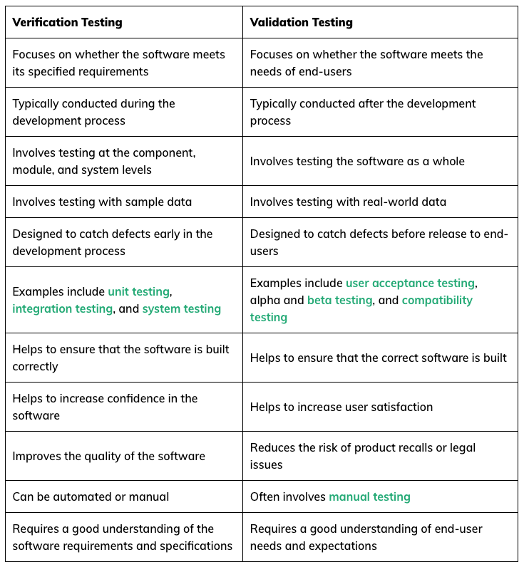

# Test automation questions NEW

## Testing Basics

#### Why is `quality assurance` important?

Quality assurance helps a company create products and services that meet the needs, expectations and requirements of
customers.

#### What is the `purpose of testing`? What is not?

**Software testing is a way to assess the quality of the software and to reduce the risk of software failure in
operation.**
\
A **common misperception of testing is that it only consists of running tests**, i.e., executing the software and
checking the results.
But test execution is only one from the many testing activities.

**The test process also includes activities such as**:

- test planning,
- analyzing,
- designing, and
- implementing tests,
- reporting test progress and results, and
- evaluating the quality of a test object.

**Dynamic Testing:**
Some testing does involve the execution of the component or system being tested; such testing is called **dynamic
testing**.

**Static Testing:**
Other testing does not involve the execution of the component or system being tested; such testing is called **static
testing**.

Another **common misperception of testing is that it focuses entirely on verification of requirements, user stories, or
other specifications**.
While testing does involve checking whether the system meets specified requirements, **it also
involves validation**, which is checking whether the system will meet user and other stakeholder needs in its
operational environment(s).

**Typical Objectives of Testing**:

- To prevent defects by evaluating work products such as requirements, user stories, design, and code
- To verify whether all specified requirements have been fulfilled
- To check whether the test object is complete and validate if it works as the users and other
  stakeholders expect
- To build confidence in the level of quality of the test object
- To find defects and failures by reducing the level of risk of inadequate software quality
- To provide sufficient information to stakeholders to allow them to make informed decisions, especially regarding the
  level of quality of the test object
- To comply with contractual, legal, or regulatory requirements or standards, and/or to verify the test object’s
  compliance with such requirements or standards

#### What is `verification` and why is it important?

`Verification` testing helps ensure the software meets the specified requirements and standards.

Verification is the process of evaluating whether a product, service, or system meets specified requirements and
fulfills its intended purpose. It involves reviewing documents, specifications, code, or other artifacts to ensure that
they conform to established standards and meet predefined criteria.

#### What is `validation` and why is it important?

`Validation` testing ensures that the software meets the needs and expectations of the end users.

Validation is the process of evaluating a product, service, or system to determine whether it meets the needs and
requirements of its intended users or stakeholders. Unlike verification, which focuses on ensuring that the product
conforms to specified requirements, validation focuses on assessing whether the product fulfills its intended purpose
and provides value to its users.

#### How can tests be categorized? Explain classifications and the categories within them.

1. **`Based on Purpose`**:
    - `Functional Testing`: This type of testing evaluates the functionality of the software system by testing each
      function or feature against the requirements. Functional testing ensures that the software behaves as expected.
        - Categories: Unit Testing, Integration Testing, System Testing, Acceptance Testing.
    - `Non-Functional Testing`: Non-functional testing focuses on the attributes of the software system such as
      performance, usability, reliability, and security.
        - Categories: Performance Testing, Usability Testing, Reliability Testing, Security Testing.
2. **`Based on Scope`**:
    - `Black Box Testing`: In black box testing, the tester examines the functionality of the software without knowledge
      of its internal code structure. Test cases are designed based on the software requirements.
        - Categories: Equivalence Partitioning, Boundary Value Analysis, Decision Table Testing, State Transition
          Testing.
    - `White Box Testing`: White box testing, also known as structural testing, involves testing the internal code
      structure
      of the software. Test cases are designed based on the code logic.
        - Categories: Statement Coverage, Branch Coverage, Path Coverage, Mutation Testing.
3. **`Based on Execution Level`**:
    - `Unit Testing`: Unit testing focuses on testing individual units or components of the software in isolation. It
      helps ensure that each unit works correctly.
    - `Integration Testing`: Integration testing verifies that the individual units or components of the software work
      together as expected when integrated.
    - `System Testing`: System testing the entire software system as a whole to ensure that it meets the specified
      requirements.
      **(Verification)**
    - `Acceptance Testing`: Acceptance testing, also known as user acceptance testing (UAT), involves testing the
      software to ensure that it meets the requirements and is acceptable to the end-users.
      **(Validation)**
4. **`Based on Automation`**:
    - `Manual Testing`: Manual testing involves executing test cases manually without the use of automation tools. It
      requires human intervention.
    - `Automated Testing`: Automated testing involves using automation tools to execute test cases. It helps improve
      test efficiency, repeatability, and coverage.
        - Categories: Functional Test Automation, Performance Test Automation, Regression Test Automation.
5. **`Based on Lifecycle Phase`**:
    - `Static Testing`: Static testing involves reviewing documents, code, or other artifacts without executing them. It
      helps identify defects early in the development lifecycle.
    - `Dynamic Testing`: Dynamic testing involves executing the software to validate its behavior against specified
      requirements. It includes various types of functional and non-functional testing.

#### What is `unit testing`? Who is responsible for write unit tests?

Component testing (also known as unit testing) focuses on testing components in isolation. It
often requires specific support, such as test harnesses or unit test frameworks. Component
testing is normally performed by developers in their development environments.

#### What is the difference between `white box`, `gray box` and `black box` testing?

1. **`Black-box testing`:** \
   Black-box test techniques (also called behavioral or behavior-based techniques) are based on an analysis of the
   appropriate test basis (e.g., formal requirements documents, specifications, use cases, user stories, or business
   processes).
    - Test conditions, test cases, and test data are derived from a test basis that may include software requirements,
      specifications, use cases, and user stories
    - Test cases may be used to detect gaps between the requirements and the implementation of the requirements, as well
      as deviations from the requirements
    - Coverage is measured based on the items tested on the test basis and the technique applied to the test basis

2. **`White-box testing`:** \
   White-box test techniques (also called structural or structure-based techniques) are based on an analysis of the
   architecture, detailed design, internal structure, or the code of the test object.
    - Test conditions, test cases, and test data are derived from a test basis that may include code, software
      architecture, detailed design, or any other source of information regarding the structure of the software
    - Coverage is measured based on the items tested within a selected structure (e.g., the code or interfaces) and the
      technique applied to the test basis

3. **`Gray-box testing`:** \
   Experience-based test techniques leverage the experience of developers, testers and users to design, implement, and
   execute tests.
    - Test conditions, test cases, and test data are derived from a test basis that may include knowledge and experience
      of testers, developers, users and other stakeholders

#### Compare the `Waterfall` and `Agile` project management models from testing perspective!

`Waterfall`:

- Linear, step-by-step model
- Clear scope, rigorous planning
- Not flexible, less adaptive and creative
- Testing is at the end, which may discover defects at a late stage

`Agile`:

- Iterative, flexible approach
- Quickly adapt to changing project requirements
- Continuous testing throughout the development process

#### `Communication skills` are important for a test engineer. Why is that? Give an example of a possible scenario where a tester needs to use their communication skills.

- `Clarifying Requirements`: Test engineers need to communicate effectively, to understand the requirements and
  expectations for the software being developed
- `Reporting Bugs`: Test engineers must effectively communicate any issues or defects they encounter during testing
- `Collaborating with Team Members`: Test engineers often work as part of a multidisciplinary team, collaborating with
  developers, designers, and other stakeholders throughout the software development lifecycle
- `Providing Feedback`: Test engineers provide valuable feedback to developers and project stakeholders based on their
  testing activities.
- `Explaining Test Results`: Test engineers need to communicate test results to project stakeholders, including managers
  and clients.

## Testing Methods

#### What is `exploratory testing` and what is its role in the testing process?

#### What is `risk-based testing`, and why is it useful?

#### What is `POM` and why is it useful?

#### What is `keyword-driven testing` and why is it useful?

Keyword Driven Testing is a scripting technique that uses data files to contain the keywords related to the application
being tested. These keywords describe the set of actions that is required to perform a specific step.

in KDT we create actions, which represent a smaller action or function on the tested page, and we can reuse these
actions (they can be methods in Java eg.). It helps code reusability, and they can have descriptive names, starting with
action verbs, so can be used easily by less educated testers/users as well.

#### What is `TDD` and why is it useful?

In test-driven development, we write the tests about the requirements before we develop any feature. And as we
implemented the tests, we start to develop the features.

#### What is `BDD` and why is it useful?

Yes, the main advantage of BDD is that it makes the development easier for the end users (stakeholders), who cannot
write code, but through user stories and with the gherkin syntax they can provide in English (or any other) language
that what they expect from the feature, from the program. This follows the given-when-then syntax, and the user story
can be translated to a test using cucumber and developer knowledge, so we can provide tests, and along with that, we can
follow TDD.

#### What is `data driven testing` and why is it useful?

In the data-driven approach, we provide data sets, which should be tested, and along with these data sets the tests and
features have to be written. The data can be stored in external tables such as Excel or XML files, or internally in the
code, using the method as a source, or other parameterized solutions.

#### Describe the `test data lifecycle`!

#### Imagine you are responsible for quality assurance in a project. The release date is tomorrow but running all the tests takes 3 days. What do you do or suggest?

#### Imagine you are in charge of testing a REST API with 5–10 different entities. How would you go about it? Plan and reason your tests.

#### Imagine you are in charge of testing a small application. How would you go about it? Plan and reason your tests. Examples: webshop, banking app, online education app, social media, etc.

## Reporting, Bugs

#### What steps would you follow if you found a defect?

#### Talk about common test reports, and about their details.

#### What does a bug report contain?

#### How would you prioritize a bug? (Trick question)

## Test Automation, Selenium, JUnit

#### How would you decide if a test case should be automated or not?

#### Test cases should not depend on each other. What does this mean and why is it important?

#### What is Selenium, Selenium IDE, and Selenium WebDriver?

#### How can be web elements identified? How do you choose which way to do it?

#### What are the syntactic elements of a xpath?

#### How can you make your Selenium bot wait for elements, what can go wrong? Collect possible errors and root causes.

#### What are the challenges and best practices with dynamically loading web elements?

#### What are the `most important annotations in JUnit` and what are they used for?

- @Test
- @ParameterizedTest
- @BeforeEach
- @AfterEach

#### How can you provide parameters to your parameterized tests in JUnit? Which way is your favorite and why?

#### How would you `set up a Selenium testing project from scratch`? What steps are important?

#### What `coding principles` do you find important in test automation and why?

#### What are some `alternatives for Selenium`? Which programming language do they rely on?

- `Playwright`:
    - Easy Setup and Configuration
    - Comes with multi-browser support like Chrome, Edge, Safari, and Firefox
    - Comes with multi-language backing like Java, C#, Python, and Javascript/Typescript
    - It comes with the parallel browser testing capabilities
    - Supports multiple tab/browsers
- `Cucumber`:
    - It helps to engage business stakeholders who can’t read code
    - It mainly focuses on end-user experience
    - It allows the reusing of code in tests because of the easy writing style.
    - Easy to set up and execute
    - Support Ruby, Java and JavaScript

## Devops

#### What is `CI/CD`? What are some popular CI systems?

#### What is `Docker` and why is it useful?

#### What is Kubernetes and why is it useful?

## Personal Questions

#### Why did you choose to learn test automation?

#### What do you like about test automation?

#### Tell me about a test automation project you worked on.

#### Can you recall an interesting technical challenge you encountered while studying test automation? What did you do about it?
